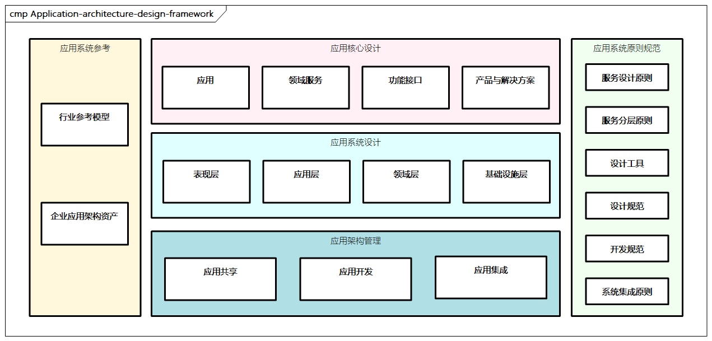

# 应用架构设计框架

应用架构构建业务架构、数据架构、技术架构之间的关联关系。**应用架构以企业业务架构为基础，规划整个企业所有应用系统的蓝图**，将业务架构中业务流程、业务能力等落实到应用系统的具体功能和服务，并对数据架构的数据分析和管理提供诉求，对技术架构中涉及的开发平台、技术选型、基础设施、集成、安全等提出要求，指导后续架构的部署与构建。

> 图例：应用架构的设计框架

应用架构的设计框架主要包括以下部分。

- **应用核心设计**：对应用架构的核心内容进行设计，包括应用、领域服务、功能接口及对应的产品与解决方案等。
- **应用系统设计**：应用对应的系统能力设计，确定系统的边界、定义、接口，包括系统对应的表现层、应用层、领域层、基础设施层。
- **应用架构管理**：应用涉及的相关协同管理，包括应用共享、应用开发、应用集成等，也涉及一些技术组件。
- **应用架构原则规范**：包括服务设计原则、服务分层原则、系统集成原则等，以及相关的开发规范、设计规范、设计工具等。
- **应用架构行业参考**：包括通用的一些行业参考模型，提供企业参考、资产沉淀和复用。
从以上可以看出，应用架构设计的核心是应用核心设计，而实际过程中领域驱动设计是非常重要的理论参考。