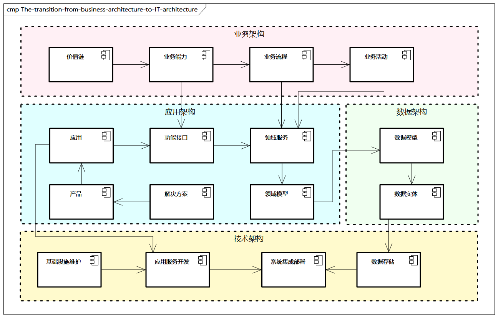
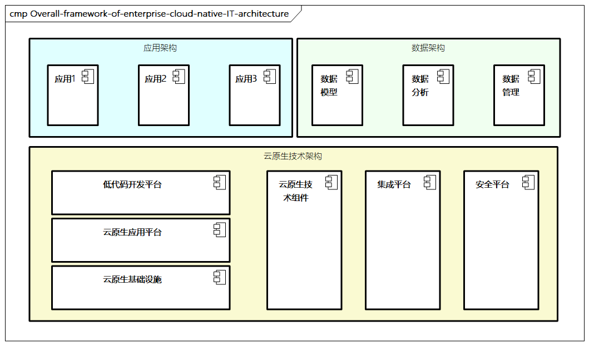

# 企业IT架构概述

企业IT架构承载着业务架构，并指导企业IT和具体项目的开展。**业务的开展依赖IT，而IT的需求来自业务**。

## 业务架构向IT架构转化的过程

在企业IT架构设计过程中，我们需要**关注IT与业务的关系，理解并转化业务方向，并进行正确的技术选型，提供IT的投资依据，结合数字化转型项目，提高企业业务和技术的核心竞争力**。

> 图例：业务架构向IT架构转化的过程

在业务架构向IT架构转化的过程中，业务架构为IT架构提供了企业业务的输入，通过对战略技术的转化，业务架构把企业的业务通过业务能力、业务流程及更细粒度的业务活动等业务需求具象化地展示出来。进而，IT架构中的**应用架构承接这些需求，通过领域驱动设计等设计方法，使用领域服务构建服务化能力，并通过服务化的功能接口等，逐步构建应用系统，同时结合业务发展，构建企业的产品和解决方案**。在整个过程中，**数据是核心，应用架构中构建的领域模型对数据架构中的数据模型进行输入，指导数据实体等数据分布和分析，并通过技术架构的数据存储进行具体的数据管理**。而应用架构产生的应用、产品、服务等内容通过技术架构提供的开发能力实施落地，比如使用微服务、云计算、云原生等应用服务开发方法，并通过技术架构中的基础设施、系统集成等完成整体技术底座的支撑和保障。

## 企业IT架构总体框架

企业IT架构主要包括应用架构、数据架构、技术架构，具体如下所示。

> 图例: 基于云原生体系的企业IT架构总体框架

- **应用架构**：涵盖应用、服务、应用组件、功能组件、服务接口等。**核心是将业务架构的业务流程和服务翻译成人们可以看得懂的应用服务和服务流程，过程中涉及领域驱动设计、服务化、微服务等相关架构设计能力**。此外，**应用架构还包括系统、共享中心、产品、解决方案等层面的系统级抽象，这是整个IT架构的关键阶段**，决定着企业为客户提供的具体的应用服务功能。
- **数据架构**：描述企业架构的**数据模型、数据分布、数据资产之间的结构和关系，是IT架构的核心**。数据架构与**应用架构的领域模型**密切相关，并与**技术架构的数据存储**紧密相连。数据架构通过数据标准、数据治理、管控流程和技术工具等方面进行制定，并协同业务架构、应用架构、技术架构层面的数据**形成统一、完整的数据标准**。
- **云原生技术架构**：通过**构建企业开发平台、运维平台来协助系统统一管理，并结合敏捷交付、精益管理等管理开发和运维一体化的平台，协助应用和数据等数字化项目落地**。云原生体系主要涉及云原生基础设施、云原生应用平台、低代码开发平台、云原生技术组件，以及一些集成平台和安全平台的构建。
