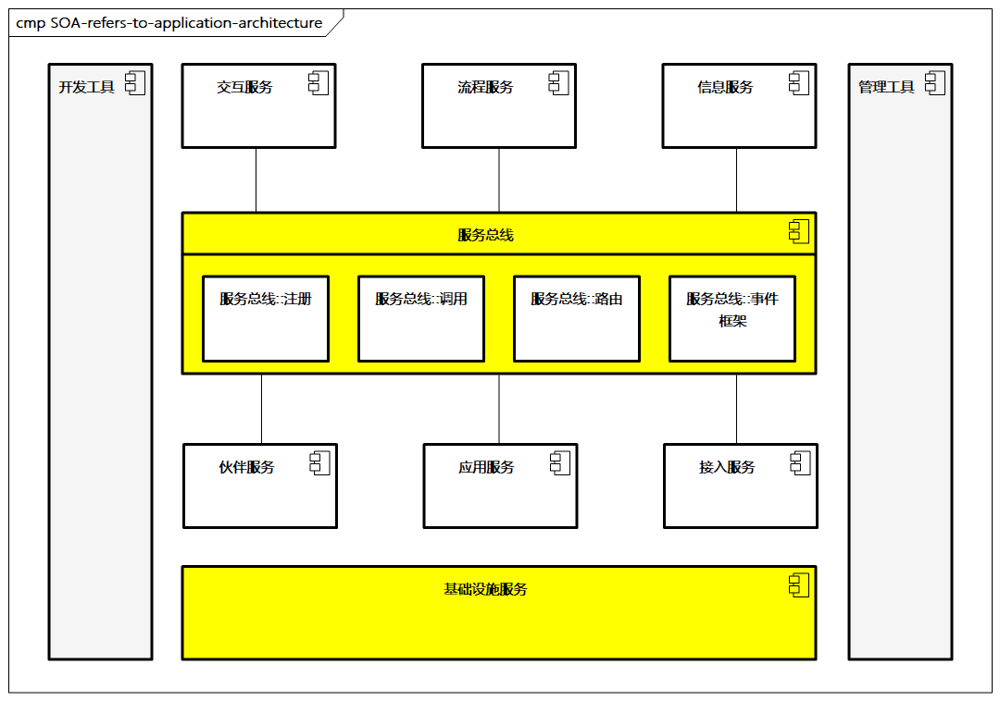
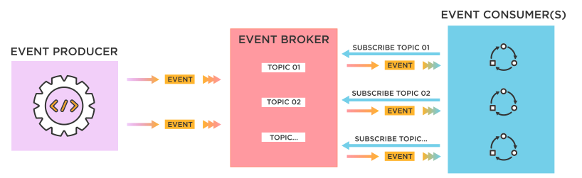
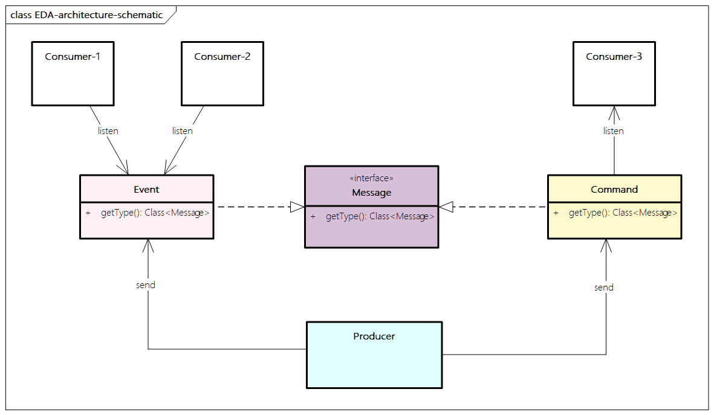
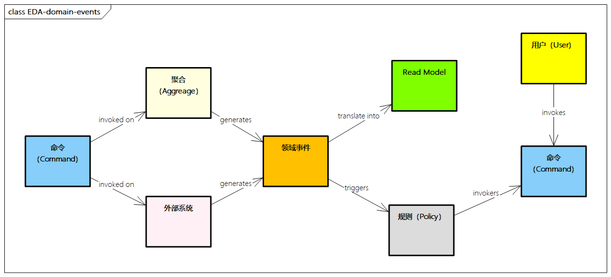
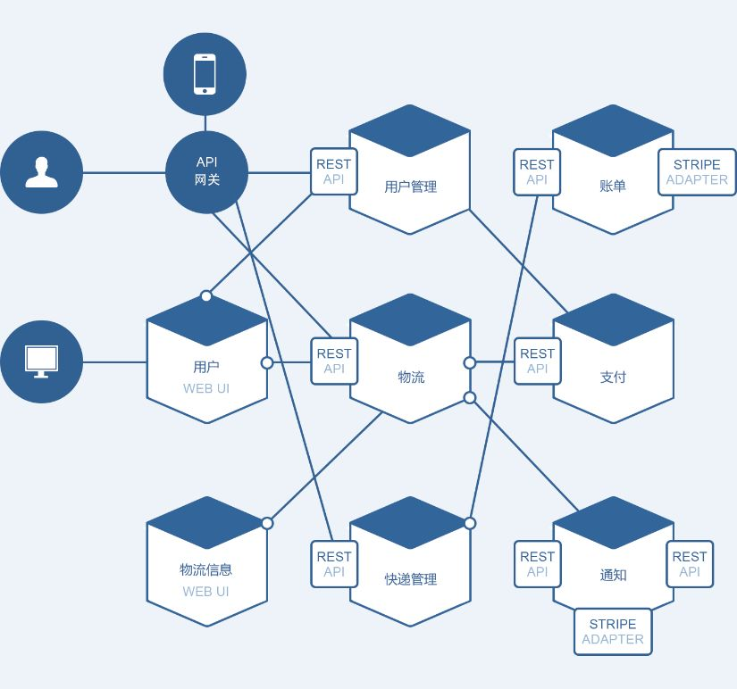

# 应用架构常用模式

应用架构常用模式主要有以下几种。

## 集中式架构

集中式架构又称单体架构，传统企业根据各个业务部门的需求，开发了多个“烟囱式”系统，这种架构模式有很多弊端，在一些传统企业中还存在。

## SOA（面向服务架构）

企业采用企业服务总线（ESB）来解决多系统之间复杂的接口交互模式，也就是传统的SOA模式。而随着互联网企业的发展，采用去中心化、去IOE的分布式服务架构，不需要ESB作为中心节点，而是进行直接发现和调用，以解决中心化服务扩展难、不适合互联网大流量要求快速响应的痛点。

[The Open Group的面向服务架构 (SOA) 工作组](https://www.opengroup.org.cn/service-oriented-architecture-soa-working-group)提出了一个[SOA架构的参考模型](http://www.opengroup.org/soa/source-book/soa_refarch/index.htm)，主要包括：

> 图例：SOA参考应用架构

SOA参考应用架构，具体包括以下几个层面。

- **基础设施服务**：由操作系统和后台的应用系统组成，能够被系统组件调用，实现IT系统服务功能，并确保服务的质量，为各层次的系统提供数据支持。
- **服务总线**：：通常由ESB系统提供路由、多协议、转换等,服务在这里注册和发现，也可以通过组合形成组合服务,并且通过对服务的服务组合和编排实现业务流程。
- **关键服务组件**：由服务使用者组成，构建前台的访问应用。
- **开发工具**：提供SOA的相关开工具，如WSDL等
- **管理工具**：提供服务质量（QoS）服务，包括安全、管理和基础设施监控等。

**SOA并不是推倒重建企业的系统，而是在现有的系统之上进行包装服务，建立标准结构，方便互通和调用**。SOA也使得架构设计的过程从面向对象、面向组件的设计方法过渡到面向服务的设计方法，其强调以服务为中心的设计理念，接口和实现分离、服务提供和服务使用分层的设计思想。

## 事件驱动架构

事件驱动架构（Event Driven Architecture，EDA）以SOA为基础，以事件为单位进行各种处理。事件驱动的核心是事件，事件是历史，是事实，是已经发生的事。

> 图例：事件驱动架构示意

事件由事件源生成，并通过事件管理器进行发布，各种事件的订阅方根据需要进行订阅消费，可以直接处理该事件，或者即时转给其他订阅方，同时事件作为一种业务数据的载体，可以进行存储，从而在以后进行处理。

> 图例：事件驱动概念示意

事件驱动系统通常是异步的，事件生产者向事件管理器发布事件，如果事件消费者不可用，事件管理器将保留这个事件，之后再次转给事件消费者。

事件生产者与事件消费者相对独立且解耦，事件生产者不需要知道哪个消费者会接收消息。事件消费者彼此之间也互相解耦，每个消费者都可以接收全部或者部分消息。因此，事件驱动架构的系统更适用于包含较多未知因素的环境或者异步的环境，通过构建分布式高可用架构，提供事件生产者和事件消费者相对灵活解耦的能力。事件驱动架构适用于多种场景，比如有多个子应用且处理相同事件，需要实时处理大量数据，有复杂的事件处理等。

> 图例: EDA领域事件

从领域设计角度，事件驱动架构也有广泛应用，比如基于事件风暴的分析方法。其中，事件源和订阅者都是具体的领域实体，事件管理器可以作为基础设施的一部分技术组件，这个过程会借助消息中间件来进行能力提供。

## 微服务架构

随着互联网技术的发展，SOA技术进一步进化为以微服务为主流的分布式服务架构。微服务是一种分布式架构模式，微服务架构凭借其简单清晰、灵活可扩展、独立部署等优势，逐渐成为分布式架构的主流。微服务将大型复杂软件应用拆分成多个微小的服务，服务之间是松耦合的，每个服务描述一个小业务，可以独立地进行升级、部署、扩展和重新启动等流程，并通过接口契约、标准协议等保持彼此互通。

微服务架构由SOA演化而来，是SOA的一种特殊实现方式，突出将服务划分为更细粒度的微服务，按照业务领域划分，强调服务编排、服务治理、自动化运维，并具备高可用、性能要求、分布式事务一致等特点。

关于微服务是什么，转述[Martin Flower 大神的系统阐述](https://www.martinfowler.cn/microservices/)：

- 微服务是一种架构风格，也是一种服务
- 微服务的颗粒比较小，一个大型复杂软件应用由多个微服务组成，比如Netflix目前由500多个的微服务组成
- 微服务采用UNIX设计的哲学，每种服务只做一件事，是一种松耦合的能够被独立开发和部署的无状态化服务（独立扩展、升级和可替换）。

> 图例：微服务架构示例

与集中式架构相比，微服务有降低系统复杂度、提高迭代效率、促进团队沟通、弹性扩展、容错能力、独立部署、可扩展性、跨语言编程等很多优点，这里挑选几个进行说明。

- **提高迭代效率**：支持细粒度的独立迭代和发布，速度快。由于微服务架构中的每个小型服务是独立部署的，可以单个服务进行缺陷修复或者特性变更，无须重新部署整个应用程序，一旦发现缺陷，就立刻回滚服务。
- **促进团队沟通**：单个小型服务仅需要一个小的开发团队就可以完成开发、测试和部署工作。相比之下，更大的团队通常意味着更低的沟通效率、更高的管理开销。
- **容错能力**：当系统出现问题时，将仅影响单个小型服务，不一定导致整个应用程序中断；同时对应的数据也将会进行隔离，风险明显降低。
- **可扩展性**：每个小型服务都支持独立水平扩展，无须扩展整个应用程序，资源的利用率高，扩展快速。每个小型服务都可以独立进行服务升级，并且结合持续集成工具可以进行持续发布，快速完成服务升级和发布流程。

微服务架构有很多好处，不过也存在以下一些挑战。

- **设计的复杂性**：与传统架构的应用程序相比，微服务架构的组件更多。服务数量多意味着部署和管理的工作量更大，还需要考虑分布式系统的复杂性和分布式事务的处理难度。
- **开发、测试、部署难度**：当服务拆分后，几乎所有功能都会涉及多个服务，所依赖的其他独立服务增多，此时处理好服务间的依赖关系成为关键。原本单个程序的测试会变为服务间调用的测试。测试变得更加复杂。
- **运维难度**：由于可能采用不同的语言和框架，应用程序可能变得难以维护。整个应用分散成多个小型服务，这导致问题定位更加困难，同时可能增加服务间的通信量。
- **数据一致性**：每个小型服务都仅负责各自相关的数据持久性，因此不同服务间的数据一致性很难达到。

## 云原生架构

分布式架构的出现是为了解决应用难以开发和维护的问题。

- **垂直拆分**：把按业务领域拆分为**多个松耦合的独立应用**，各自独立部署和维护。
- **水平拆分**：把**通用的、共性**的应用进行分层沉淀，**形成共享的服务能力**，这样可以对性能稳定性等问题进行统一处理和优化，防止重复开发。

如今，架构朝着越来越轻量化、能力越来越下沉、应用越来越灵活的方向发展，到云原生时代达到了新的高度。

**云原生将云应用中的非业务代码进行最大化的剥离，关注点分离，让云来负责原有的大量非功能特性需求，如可靠性、扩展性、可观测性、弹性、轻量、敏捷、自动化等**。

同时，有很多企业也在尝试“双IT架构”，即以云原生架构来应对敏态业务的快速变化，以及传统的基于ESB方式的架构应对稳态内部系统的管理，二者相互结合并互补。

## 扩展阅读

- [微服务体系结构设计 - Microsoft](https://learn.microsoft.com/zh-cn/azure/architecture/microservices/)
- [微服务评估和准备情况 - Microsoft](https://learn.microsoft.com/zh-cn/azure/architecture/guide/technology-choices/microservices-assessment)
- [设计微服务体系结构 - Microsoft](https://learn.microsoft.com/zh-cn/azure/architecture/microservices/design/)
- [适用于微服务体系结构的 CI/CD - Microsoft](https://learn.microsoft.com/zh-cn/azure/architecture/microservices/ci-cd)
- [使用域驱动设计将整体应用程序迁移到微服务 - Microsoft](https://learn.microsoft.com/zh-cn/azure/architecture/microservices/migrate-monolith)
- [微服务应用程序的统一日志记录 - Microsoft](https://learn.microsoft.com/zh-cn/azure/architecture/example-scenario/logging/unified-logging)
