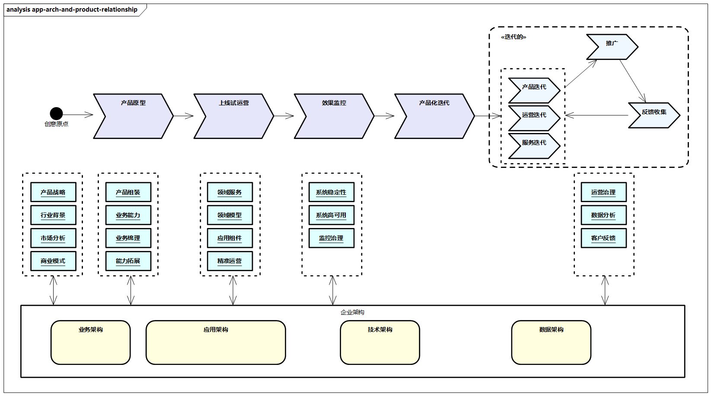
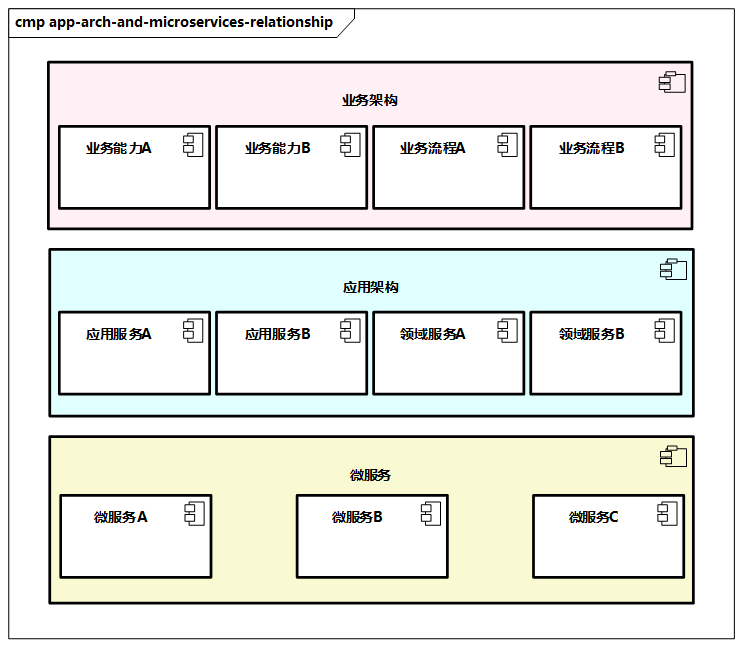

# 应用架构与周边概念的关系

我们来看看应用架构与周边概念的关系。

## 与产品的关系

应用架构可以体现企业产品化的规划，有时产品架构可以用应用架构的形式表达，**其本质上是以产品的视角进一步抽象领域建模，进而进行高度的产品抽象**。产品设计本身是一个很大的主题，是产品经理关注的事情，应用架构关注更多的是产品的组成部分及各组成部分之间的关系。

> 图例：企业架构中应用架构与产品的关系

上图展示了企业架构中应用架构与产品的关系，可以看出，产品的原型设计、上线试运营、效果监控、产品化迭代与企业架构有紧密的联系，其中应用架构具有重要的作用，包括产品组装、能力扩展、领域服务、领域模型、应用组件等，可以给产品从产品形态、运营模式、迭代开发等方面提供很多反馈，对企业业务运营模式、产品迭代方向有着重要的指导作用。

## 与解决方案的关系

有的企业在对外提供产品的同时，也对外提供解决方案，它们通过对客户聚焦的行业或特定领域提供解决方案，在服务好客户的同时也对产品进行更好地组合和优化。

解决方案本身是企业架构之外的主题，不过**从应用架构层面来说，解决方案属于整体的最上层，解决方案通过对产品、应用的组合，更加适应不同垂直细分客户的诉求**。解决方案也可以进一步细分为行业解决方案、通用领域解决方案、产品定制解决方案、生态解决方案等，而行业解决方案还可以细分为新零售、金融、政府、教育、物流、医疗、能源、文化、旅游、房地产等。**应用架构中的一些关键要素（如应用和服务）是否可以快速组合，是否可以重用和方便扩展，是否足够稳定等，也决定了解决方案的构建效率**。

## 与服务、微服务的关系

服务原则上有业务服务、应用服务、系统服务等多种分类。在业务架构中，业务服务要通过业务能力和业务流程来体现，在应用架构中是应用服务、系统服务所在的主体。

**应用服务是构成业务活动的基本单元，而业务活动是构成业务能力和业务流程的基本单元**。同时，应用架构**基于DDD，又可以分为应用层和领域层，也就是有对应的应用服务和领域服务**，通过层次的分离，可以很好地降低各个服务的复杂度及依赖度。

> 图例：应用架构与微服务的关系

业务架构把企业的业务通过业务能力、业务流程及更细粒度的业务活动等具象化地展示出来。应用架构承接这些需求，通过DDD，使用领域服务构建服务化能力，并通过服务化的功能接口等，逐步构建应用系统，同时结合业务发展，构建企业的产品和解决方案。**微服务是应用架构的一种落地实现方式**，其中很多设计原则的指导适合应用架构（如微服务的划分方法），同时涉及一些技术层面，这个在技术架构和项目运营治理中有所关联，如DevOps和CI/CD。同时，**微服务架构的设计过程从面向数据的过程转变为面向领域和面向服务的过程**。微服务其实**贯穿了应用服务设计、技术侧的微服务开发框架、项目管理与运维侧的持续集成和自动部署**等。

## 共享服务中心的关系

有些企业将核心能力以数字化形式沉淀为各种共享服务中心，并强调通用能力的沉淀，而**本质上共享服务中心是应用架构的一部分，是其中共享应用或者共享服务的**。应用架构的关键概念、DDD建模方法、相关的原则规范对共享服务同样适用。

> 在电商领域，后台系统（如商品系统、订单系统、库存系统等）以共享服务中心的方式，承担通用的共享能力，整合、屏蔽下层系统，提供前端敏捷访问。
