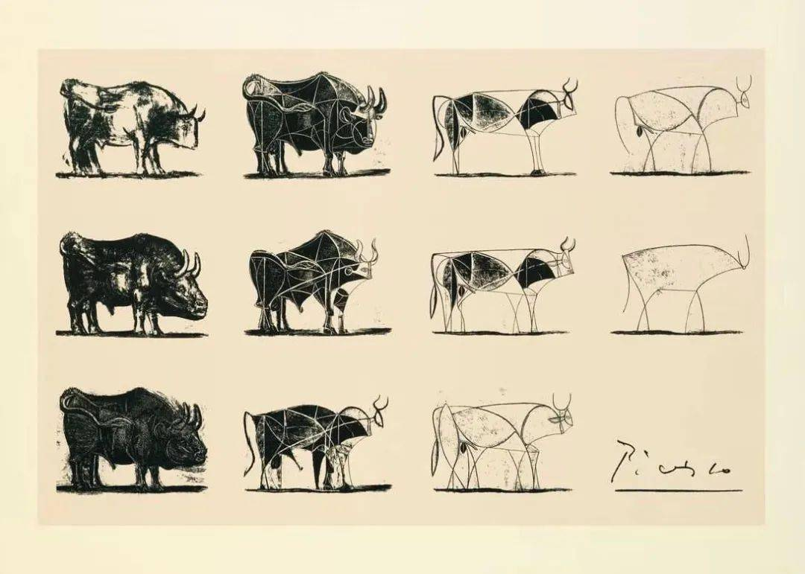
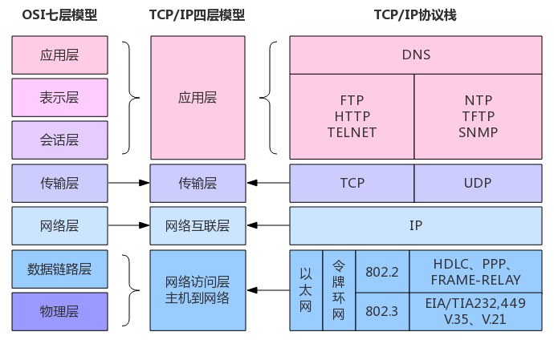
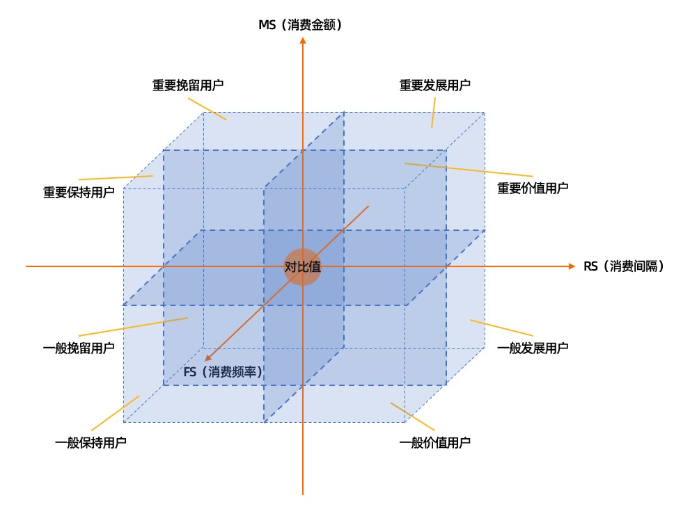
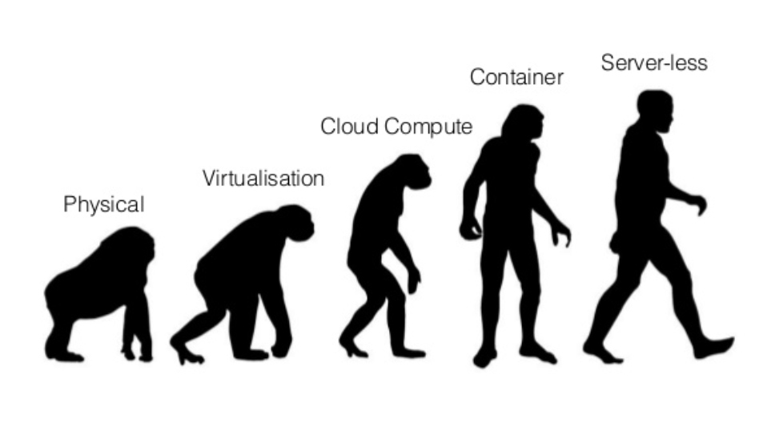

# 什么是架构

## 架构的本质

架构本身是一种抽象的、来自建筑学的体系结构，其在企业及IT系统中被广泛应用。

架构的**本质是对事物复杂性的管理**，是对一个企业、一个公司、一个系统**复杂的内部关系进行结构化、体系化的抽象**，并把相关的目标和当前现状**通过不同的视图进行直观展示**，方便相关人员**达成共识**，**指导和驱动**数字化项目**落地实施**。

那到底什么是架构？下面我们先来看几个定义。

1. **百度百科的定义**：架构，又名软件架构，是有关软件整体结构与组件的抽象描述，用于指导大型软件系统各个方面的设计。
2. **维基百科的定义**：架构即软件体系结构，是指软件系统的基本结构，以及创建此类结构的规则及这些结构的文档。每个结构包括软件元素，它们之间的关系，各个元素和它们之间的关系的属性，以及每个元素引入和配置的基本原理。
3. **ISO/IEC 42010的定义**：一个系统在其所处环境中所具备的各种基本概念和属性，具体体现为其所包含的各个元素、它们之间的关系，以及架构的设计和演进原则。
4. **IEEE的定义**：架构是环境中该系统的一组基础概念和属性，具体表现就是它的元素、元素之间的关系，以及设计与演进的基本原则。
5. **CMU软件工程研究院的定义**：架构是用于推演出该系统的一组结构，其具体是由软件元素、元素之间的关系，以及各自的属性共同组成的。
6. **TOGAF（The Open Group Architecture Framework，开放组架构框架）的定义**：一个系统的形式化描述，或指导系统实现的构件级的详细计划。一组构件的结构、构件间的相互关系，以及对这些构件的设计和随时间演进的过程进行治理的一些原则和指导策略。

综合上述定义，可以看出，对于架构的定义有几个高频关键词：**元素、结构、关系、原则、演进**。

**一句话总结：架构是将相关元素按照一定的结构连接在一起，同时提供相应的原则和规范进行持续演进的一种方法、活动和模型。**

> 架构就像建筑学中的体系结构，比如在故宫平面图中，整体的结构、房间的主次、彼此连通的道路通过一张图可以直观地展现出来，同时各个房间的大小也按照实际情况进行了精准的绘制，这其实就是架构的美妙之处。

## 四个重要的架构思维方式

在这个管理事物复杂性的过程中，有四个非常重要的架构思维，分别是抽象思维、分层思维、多维思维和演化思维。

### 抽象思维

**抽象是对某种事物进行简化描述的过程**，关注关键元素，忽视其他细节。

抽象在架构设计中非常重要，**抽象能力的强弱，直接决定着我们所能解决问题的复杂性和规模大小**。

> 例如积木城堡游戏，一个城堡由若干子模块组成，而每个模块最终由不同形状的积木搭建而成，这种自上而下或者自下而上的抽象组合过程在架构设计中十分重要。

**抽象关键元素，忽视其他细节**，下图所示的毕加索抽象画，毕加索对一只复杂的公牛进行了高度的抽象和简化。

> 图例： 抽象思维举例：毕加索《公牛》

> 比如，从电商角度，一个系统可能被我们抽象出不同的模块，以下订单为例，可能需要经过商品价格查询、库存更新、优惠方式计算、支付方式校验、物流方式更新等一系列流程，这一系列流程本身就是对高度抽象过程的总结。

### 分层思维

**分层是在抽象的基础上进一步体系化地分析事物**，因为抽象出来的元素可能不在同一层次，比如可能需要我们从业务模块的垂直层面或者系统功能的水平层面进行思考。

分层思维是很重要的架构思维，比如我们看到的操作系统，就可能被分为内核、内存管理、输入和输出管理、文件管理、用户界面层。

> 图例：网络分层模型

如上图所示的网络分层，经典的七层模型即物理层、数据链路层、网络层、传输层、会话层、表示层、应用层。

> 比如，人们经常讨论的技术架构包含部署架构、集成架构、开发架构、测试架构、运维架构、安全架构等，这些都是从不同层次进行划分的。

### 多维思维

随着事物复杂性的提高，我们往往需要**从不同维度对事物进行分析**。

分层思维帮助我们从不同层面对事物进行分析，而**多维思维要求在架构分层的基础上，从更广、更高的维度对事物进行综合分析**。

> 比如，一般我们在做架构设计时，需要分析业务需求、业务流程、领域建模、技术支撑，除了对每层进行分析，我们还需要分析什么业务与什么流程匹配、什么流程与什么模型对应、什么模型使用什么技术，同时要结合组织阵型、项目运营管理，从不同维度来进行全面的分析。

多维思维更多**强调矩阵分析**，比如衡量客户价值和客户创利能力的典型模型——RFM模型，通过三个维度不同分类的组合，分解出八种客户画像。

> 图例：[RFM模型 - 阿里云](https://help.aliyun.com/document_detail/420480.html)

### 演化思维

**架构是设计出来的，更是演化而来的**。

架构的形成是一个不断迭代的过程，而这个过程其实是**对整个企业进一步有序化地重构和升级，以实现进化并支撑业务快速发展**。

可以说，**人类世界是以分层方式一层一层搭建和演化而来的**。

**架构模式不是固定的**，比如架构经历了从单体模式到SOA（Service Oriented Architecture，面向服务架构）模式，从SOA到微服务架构，从微服务架构到云原生架构的演变。

再以云原生技术中的Serverless为例，图从物理机（Physical）时代、虚拟机（Virtualisation）时代、云计算（Cloud Compute）时代、容器（Container）时代到达无服务器（Serverless）时代，使用户无须关注程序运行环境、操作系统、网络配置、资源及容量，只要将精力聚焦在业务逻辑和技术上即可。

> 图例： Serverless演化

## 典型误区

基于架构的本质，反观我们平时接触到的架构，往往有一些典型的误区，具体体现在以下几个方面。

### 缺乏全局架构视角

数字化转型的首要切入路径是“全局战略，总体架构规划”，然而很多企业缺乏全局架构视角，认为架构仅指IT架构，或者更小的运维层面，**其实架构涵盖企业的战略、业务、应用、技术、数据、产品、运维、部署、集成等方方面面，总体规划和全局视角非常关键**。

### 缺乏架构治理演进

架构设计**不是静态的，而是动态演进的**。只有不断应对变化的架构，企业才有生命力，因此企业需要借助相应的架构治理来推进架构的持续演进。

这个过程也是**体系化的过程**，如相应的**架构成熟度评估、相应的组织和决策机制、架构的设计原则和规范，以及长期的运营治理意识和机制保障**是必不可少的。

### 组织缺乏有效保障

**架构需要组织的保障**，一些传统企业仅仅要求IT部门的运维人员进行系统维护，对架构不够重视。

其实，架构既需要全方面构建，也需要对应的组织保障，比如企业应设立对应的架构委员会，提升对架构的认知，同时明确对应的角色、权责，以及相关的人才培养和考核机制等，企业应更加包容和开放。
