# 业务架构的关键要素

## 商业模式

> 管理大师德鲁克曾说过：“当今企业之间的竞争，不是产品之间的竞争，而是商业模式之间的竞争。”

商业模式本质上是企业战略层面需要考虑的，但由于其对业务架构有着至关重要的作用，我们在此进行分析。

**商业模式是企业生存的“窍门”，可以帮助企业将内外部各要素整合起来，形成一个完整、高效、具有独特核心竞争力的运行系统，从而满足客户需求、实现各利益相关方价值的最大化，最终使企业持续盈利。**

商业模式最核心的三个组成部分是创造价值、传递价值、获取价值，三者是密切相关的环节。

- **创造价值**：基于客户需求，提供价值方案。
- **传递价值**：通过资源配置和相关行动来传递价值。
- **获取价值**：通过一定的盈利模式来持续获取利润。

### 商业模式举例

在互联网和数字化时代，企业尝试突破传统商业模式的束缚，将生产、营销、交易、物流、支付等合为一体，打破时空的限制，并结合移动互联网、大数据、人工智能、云计算等，从根本上改变人们的消费理念和生活方式。同时，新零售也在尝试转型，如线下实体转线上发展，线上电商寻求线下突破。这里我们来看几种典型的电商商业模式。

- `B2C（Business to Customer）`：企业与消费者之间，是电商最普遍的模式，指商业零售，商家直接面向消费者，在线上销售自己的产品和服务。典型的例子如天猫、京东等。
- `B2B（Business to Business）`：企业与企业之间，也就是供应方和采购方之间通过电商作为中间运营者达成产品和服务的交易，解决供应商上游到中游的问题。典型的例子如阿里巴巴等。
- `C2C（Customer to Customer）`：消费者与消费者之间，针对海量商品和类目，做更加个性化的定制，形式与B2C比较接近，更加注重商品品质和服务。典型的例子如淘宝、微店等。
- `C2M（Customer to Manufactory）`：消费者与工厂直接对接，定制化生产和消费。C2M去掉了消费者和制造商之间的品牌商、零售商，更加注重定制服务与增值服务。典型的例子如淘宝特价版、拼多多等。
- `O2O（Online to Offline）`：线上与线下的融合。比如，线上获取信息，引流到线下购买；在线下体验后，将消费者引流到线上下单。这是典型的新零售商业模式，如今很多传统企业在O2O上发力。

**商业模式没有确切的行业标准，因为各个企业的经营之道不同.**

> 就新零售来说，我们可以从多种角度拆分出不同的商业模式。比如:
>
> - 从**交易模式**角度，可以分为直营、分销、寄售等；
> - 从**履约链路**角度，可以分为实时购、次日达等；
> - **从库存的角度**，可以分为预售、共享等；从会员营销角度，可以分为优惠活动、付费会员等；
> - 从**用户体验**角度，可以分为直播、拼团、秒杀等。

### 商业模式分析工具

对于商业模式的分析有很多方法，各个咨询公司（如普华永道、德勤、毕马威、IBM、麦肯锡等）都进行了商业模式分析。商业模式分析是极其专业和复杂的，这里简单介绍两种商业模式分析工具。

#### 魏朱六要素商业模式模型

魏朱六要素商业模式模型是比较典型的商业模式分析工具，其认为商业模式主要包括六个主要要素:

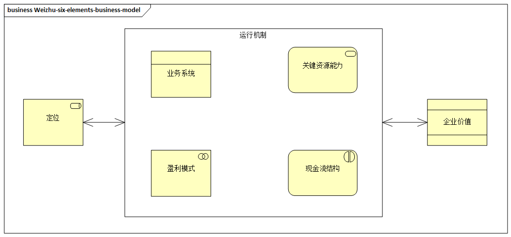

> 图例：魏朱六要素商业模式模型

- **定位**：应该提供什么样的产品和服务来实现客户的价值。定位是企业战略选择的结果，是商业模式分析的起点。
- **业务系统**：达成定位所需要的业务环节，以及相关角色之间合作与交易的方式，业务系统是商业模式的载体。
- **关键资源能力**：使业务系统运转所需要的重要资源和能力。
- **盈利模式**：指企业如何赚取利润，涉及各价值链中利益相关者之间利益的分配方式。
- **现金流结构**：是企业经营过程中产生的现金收入和支出的链条，反映该商业模式的投资价值。
- **企业价值**：是企业的投资价值，是评判企业商业模式优劣的标准。

#### 商业模式画布

商业模式画布应用得非常广泛，最初是由亚历山大·奥斯特瓦德（`Alexander Osterwalder`）提出的，通过商业画布的九宫格，我们可以将企业商业模式可视化，全面分析企业的商业情况。

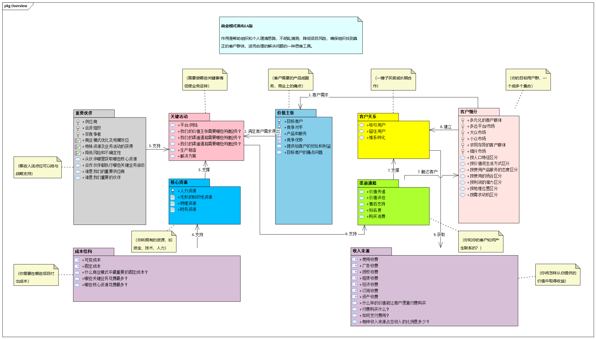

- **价值主张**：为客户提供什么产品、服务及价值，以及帮助客户解决什么问题？价值主张是企业区别于竞争对手的地方，通过各种元素提供价值，如新颖、性能、定制、把事情做好、设计、品牌、价格、成本、风险低、可达性和可用性等。
- **客户关系**：与客户建立什么样的关系？客户关系包括个人协助、专属服务、自助服务、自动化服务、社区、共同创造等。
- **客户细分**：目标客户群体是谁？根据客户的不同需求和属性，对客户群体进行细分，以满足所选择的客户群体的需求。客户细分群体存在不同的类型，如大众市场、利基市场（特殊需求的小众市场）、区隔化市场、多元市场等。
- **核心资源**：拥有什么核心资源可以保障商业行为的执行？比如，实体资产、知识资产、人力资产、金融资产等。
- **关键活动**：需要做哪些事情才能使得产品和服务能够正常运行？比如，制造产品、解决问题、构建平台和相关的服务网络。
- **渠道通路**：通过什么方式将产品和服务触达客户，使得客户可以为之买单？渠道通路的思考分为五个阶段，包括认知、评估、购买、传递、售后。渠道可以分为自有渠道（如店面）、合作伙伴渠道（如分销商）、自有渠道和合作伙伴渠道的结合，同时从新零售角度还可以分为线上渠道、线下渠道及O2O渠道等。
- **合作伙伴**：主要需要和哪些上游和下游企业深度合作？合作关系分为四种，即战略联盟关系、竞争合作关系、新业务合作关系、供应商和购买方关系。合作的本质是资源的互换，并从合作中共赢。
- **成本结构**：在所有的商业运作过程中是否都考虑了成本？常见的成本结构类型有成本驱动和价值驱动，成本结构需要考虑固定成本、可变成本、规模经济及范围经济。
- **收入来源**：业务的主要收入来源是什么？产生收入的方法有资产出售、使用收费、订阅收费、租赁收费、授权收费、经济收费、广告收费等。

如下面某手机品牌商的商业模式示例：

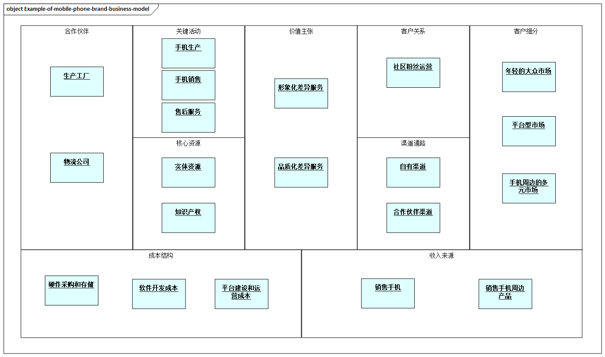

> 图例：某手机品牌商的商业模式示例

## 价值链

价值链建立在商业模式的基础之上，下面我们进一步分析业务架构的价值链。

> [价值链](https://zh.wikipedia.org/wiki/%E5%83%B9%E5%80%BC%E9%8F%88)是由战略管理学家[迈克尔·波特（Michael Porter）](https://zh.wikipedia.org/wiki/%E8%BF%88%E5%85%8B%E5%B0%94%C2%B7%E6%B3%A2%E7%89%B9)于1985年提出来的，**“每一个企业都是在设计、生产、销售、发送和辅助其产品的过程中进行种种活动的集合体。所有这些活动可以用一个价值链来表明。”**

价值链用于描述从开始到结束创建企业的产品和服务所需的所有业务活动，如采购、设计、生产、销售、服务等。价值链分析为企业提供了可视化模型，以更好地分析这些活动。

> 举个例子，铅笔从原材料到最终使用，涉及木材、石墨芯的获取、加工，以及铅笔的设计、制造、销售等，这些环节都是价值链的一部分。

价值链分析是企业分析自身为创造产品而进行的活动的一种方法，一旦对活动进行了分析，企业就可以利用结果来评估增强竞争优势的方法。企业可以通过提高效率、降低成本、提高差异化等增强竞争优势，为目标市场提供最大价值。

### 价值链分析步骤

**1. 确定业务的主要活动和支持活动**

各种业务相互关联的活动共同构成了价值链，包括从原材料到最终产品所需的每一个环节。具体可以参考后面的“波特价值链分析模型”。

**2. 分析活动的价值和成本**

分析每项活动如何为客户和整个业务提供价值。

**3. 找到获得竞争优势的机会**

完成价值分析后，查看活动的成本，确定哪些活动不具有成本效益，哪些活动可以优化。

### 波特价值链分析模型

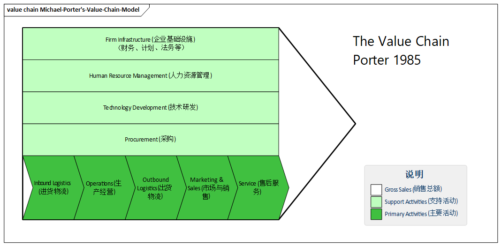

> 图例：波特价值链分析模型

在价值链分析理论中，比较典型的是“波特价值链分析模型”。该模型主要分为两个部分：

- **基本活动（纵向）**，一般涉及企业各个业务的部门
  - **供应**：从供应商那里获得材料和资源的方式。
  - **生产**：资源的生产方式，最终产生产品或服务。
  - **交付**：完成后分发的交付过程。
  - **销售**：如何呈现并销售到理想的目标市场。
  - **售后运营**：为客户提供支持，包括对产品的售后、服务和日常运营。
- **支持性活动（横向）**，一般涉及企业的职能部门。
  - **坚实的基础设施**：对财务、计划、法务等做出业务决策和有效地管理资源。
  - **人力资源管理**：管理员工所涉及的所有流程和系统。
  - **研发**：企业产品和服务的研发能力，企业的价值差异所在。
  - **技术**：技术体系发展有助于企业价值链创新。

在企业的核心竞争力分析方面，波特也提供了关于**竞争力的“五力分析”，可以帮助企业选择竞争策略**。波特五力模型在一个简单的模型中汇集了大量不同的因素来分析一个行业的基本竞争格局，主要包括以下五个部分。

- **供应商议价**能力。
- **买方议价**能力。
- **新进入者的威胁**。
- **替代品的威胁**。
- **行业内现有竞争者的竞争**。

此外，在实际工作中，一些企业经常使用SWOT分析法来分析企业的竞争力，将与研究对象相关的内部优势和劣势、外部机会、威胁进行系统分析，从中得出一系列相应的结论。

SWOT的含义如下所示：

- **S(Strengths)** ：优势
- **W(Weaknesses)** :劣势
- **O(Opportunities)** :机会
- **T(Threats)** :威胁

## 业务能力

业务能力代表企业**运行其业务所需要的全部核心能力**，是从**业务视角为实现特定目的或结果而可能拥有或交换的特定能力或产能**。

业务能力需要**尽可能与商业模式和价值链对应起来**。

之所以说业务能力很关键，是因为它**通过业务结果和价值来表达**，从而确保与战略和业务的衔接，与客户旅程和战略场景的外部视角相联系，同时促使业务与IT保持一致。

**业务能力本身比较粗粒度**，可以帮助企业从不同的视角进行业务规划。在[TOGAF](../ea-theory/togaf.md)中，由**角色**、**流程**、**信息**和**工具**的组合可以实现业务能力。

> 在其他理论中，也将业务能力看作一些企业架构概念的分组，包括人、组织、功能、流程、业务服务、信息数据、应用、基础设施，同时映射到企业的项目和解决方案当中。

业务能力可以提供**独立于**当前组织结构、业务流程、应用系统及产品或服务组合的**业务视图**。

在业务架构的体系当中，业务能力最为重要的是把企业业务最核心的业务功能体系化地表现出来。

> 比如，电商常见的业务能力示例，涉及对店铺、商品、会员营销、订单交易、物流库存、结算支付、售后服务等各方面的管理，这些管理所产生的能力就是顶层的业务能力，同时可以分解为多个下层业务能力。
>
> 比如，订单交易可分解为平台订单、自营订单、第三方订单、订单寻源、订单拆分等。

### 业务能力分析方法

业务能力分析方法很多，我们可以从以下方法入手。

- **自上而下**：首先确定最高级别的业务能力，再将各项能力分解为更详细的子能力。这种方法需要强有力的治理和高层的支持。
- **自下而上**：从业务的不同部分定义业务能力，并进行自下而上的归纳构建。这种方法比自上而下的方法耗时多。
- **上下结合**：将自上而下和自下而上的方法相结合，对业务能力模型进行提炼。

无论采用何种方法，分析业务能力均涉及几个重要的信息，如商业模式、价值链、组织结构及当前的业务战略计划。

企业在分析业务能力时要从多种业务维度进行，如预购从支付方式维度、次日达从时间维度、店铺红包从优惠券维度。在业务能力的构建中，企业需要注意以下事项。

- 业务能力的命名最好**采用“名字+动词”的组合方式** 。
- 尝试[MECE分析法](https://zhuanlan.zhihu.com/p/30828074)，即**相互独立，完全穷尽**。
- 确保在堆栈中的每个级别的**粒度都保持在相似的级别**。
- 业务能力需要迭代和持续改进，**不要浪费太多时间在每次迭代上**。
- 试着**在实际的项目情况**下，与其他人一起**对模型做检查**。
- 业务能力可以为企业IT进行能力的梳理，但其**不是解决所有问题的“灵丹妙药”**。
- 业务能力**重点是描述正确的事**，而不是如何去做。
- 业务能力**要有结果，有明确的价值**，但不是具体的流程和价值流。
- 业务能力**要有明确的界定能力**，并且有一定层级关系。
- 业务能力**相互之间要做到能力是唯一**的。
- 业务能力**进一步分解，体现在业务流程的活动级别**。
- 业务能力的**分层是能力的归组关系**，并不是流程分解的关系。

业务在迭代循环中，也可以通过一些指标进行评估，构建业务能力热点映射图，相关的考虑维度可以有以下几点。

- 战略贡献
- 有效性
- 收入贡献
- 成本分摊
- 业务单元覆盖率
- 关键性

### 业务能力分层

业务能力具有分层，**分层是在类别和层次内对业务能力进行分类和分组的过程**。

分层的目的是使业务能力更容易被理解。**各个分层为不同的干系人提供不同的层次**。

> 例如，顶层通常代表战略执行职能，中间层通常代表业务的核心和面向客户的要素，而底层通常将那些后台内部系统能力进行分组。

不同角色关注不同层次的能力。在实践中，业务能力通常被分解为三至六个业务能力级别。

从传统行业的参考模型来看，业务能力可以分为纵向和横向两个维度。

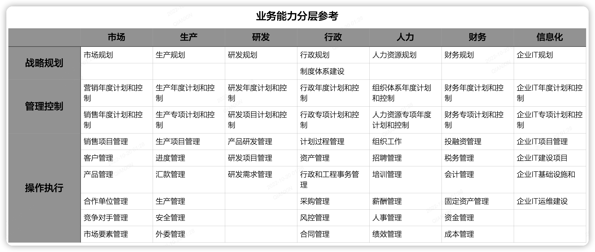

> 图例：业务能力分层参考

- 纵向是职能层次，可分为战略规划、管理控制、操作执行三个层次
- 横向是业务层次，是企业创造价值的能力，涉及市场、生产、研发、行政、人力、财务、信息化等方面

横向的业务类型基本上大家都很熟悉了，主要对纵向的分层进行一些解释。

- **战略规划** ：企业高层管理者负责的范畴。明确战略方向，建立总体的方针和政策等。
- **管理控制** ：企业中层管理者负责的范畴。负责把战略落实到日常的运营当中，监督和管理相关业务和技术指标
- **操作执行** ：进行具体操作的活动和执行动作，注重作业效率和处理能力，通常以任务的形式进行分解

### 业务能力增量

业务能力也有**资产化**的能力，需要**持续迭代和沉淀**，企业可以基于已有的业务能力进行进一步的优化，这就引出了“业务能力增量”的概念。

> 在大多数情况下，**业务能力增量只是改变业务能力的某些方面，而不是引入全新的功能**，同时业务能力增量对应架构治理当中的过渡架构。

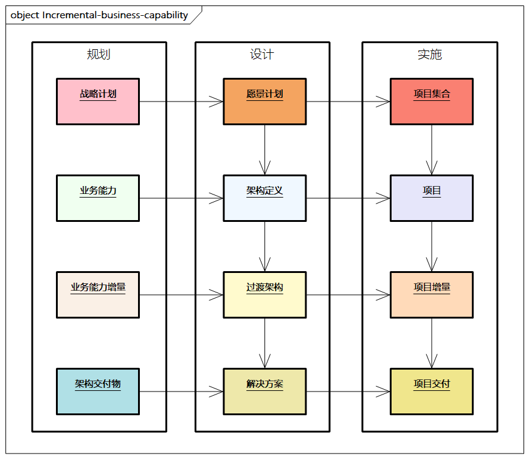

> 图例：业务能力增量

业务能力增量是业务能力的附加部分，对应过渡架构及后续的项目增量。**过渡架构是当前和未来状态架构间的中间形态**。业务能力增量**记录实现业务或IT策略所需的每项业务能力的变更细节**。

业务能力可以分解为一个或多个能力增量。业务能力增量之间**具有依赖性，可能存在先后顺序**。

### 业务能力组件

在业务架构中，为了进一步有效地管理业务能力，通常进行业务能力组件。业务能力组件就是把企业的产品、销售、采购、生产、财务等业务功能转变成业务模块。业务能力组件是构建专业化的业务功能模块，在一张图上就可以直观地显示出企业的业务能力。

企业可以将[基于组件的建模（Component Based Modeling，CBM）](https://zhuanlan.zhihu.com/p/472261763)作为业务能力组件的理论参考。CBM不仅是对企业高层次的描述，还是一个内容丰富的业务模型设计工具，通过组件化的方式对企业进行分析和设计。一般来说，企业根据业务的复杂程度，会有100～200个业务能力组件，涵盖企业所有的业务活动。每项能力可以再细分为活动，同时结合流程及后续的服务进行组合。

最终的业务组件模型图是一个二维矩阵，纵轴代表企业的管理层级，横轴代表企业的业务能力。业务组件模型可以按照业务能力和责任级别两个维度对组件进行组织。

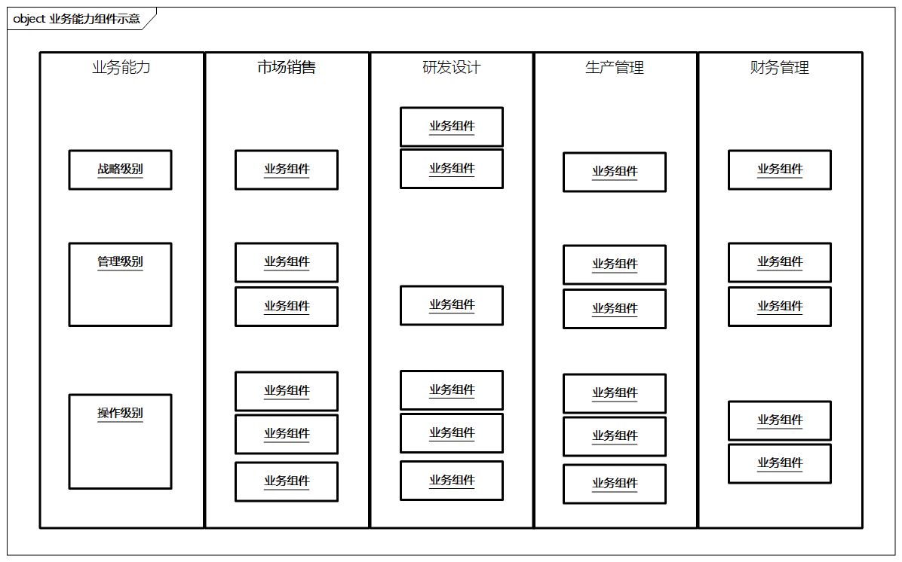

> 图例：业务能力组件示意

上图为业务能力组件示意图，按照业务能力划分各个活动并形成组件，使企业从较高层次掌握该组件的价值。业务能力组件可以由以下几个层次组成。

- **战略级别**：向其他组件提供战略方向和企业策略，并促进组件间的配合。
- **管理级别**：在战略级别和操作级别之间发挥作用，如监控业绩、管理例外。
- **操作级别**：实际操作执行层面的业务行动，促进企业的价值实现，为最终客户使用。

业务能力组件与业务流程不同，每个业务能力组件都可能成为一个独立的业务模块。每个业务能力组件包括五个维度。

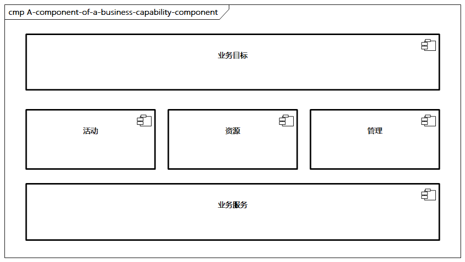

> 图例：业务能力组件的组成部分

- **业务目标**：在组织内部存在的目的，表明该组件向其他组件提供的价值。
- **活动**：为了实现业务目标，每个组件都要执行一系列相互独立的活动。
- **资源**：完成活动需要的各种资源，如人员、知识、资产等。
- **管理**：治理模式，通过相对独立的实体方式进行管理。
- **业务服务**：每个业务能力组件都可以通过服务的方式进行交互。

业务能力组件的特征包括以下几点。

- 由**一定的资源、技术与人员**组成，具备**一定的业务能力**，有**明确的业务目标**。
- 业务能力组件之间**没有明显的界限**，既可以独立完成，也可以组合调用。业务能力组件是**多个业务活动的聚合**，通常采用松耦合的形式。
- 业务能力组件**覆盖企业所有的业务活动**，既可以由企业自身承担，也可以外包给其他组织。
- 业务能力组件是**独立的业务模块**，承担特定的职责。**输入和输出要求高度标准化**，业务能力组件不能直接使用其他组件内部的活动和资源，需要**使用标准接口**。
- 业务能力组件**有自己的资源**，包括IT资源、服务资源、数据资源、组织资源等。具体的资源分析需要通过后续架构（如应用架构、数据架构、技术架构等）进行分解和映射。

## 业务流程

### 业务流程概述

**业务流程是由一系列的业务活动经过一定的逻辑组合起来，从而实现某种业务目标的过程**。业务流程是业务架构设计阶段非常重要的内容。**业务流程关系到企业各类资源的利用效率，并且会映射到企业IT架构中的应用功能及系统集成需求的具体形态**。

业务流程与商业模式、价值链密切相关，**业务流程可以初步理解为价值链的进一步流程细化**。

业务流程与业务能力有所区别，虽然二者都是企业业务活动的组合，但二者的定位不同：

- **业务能力**是面向企业核心业务的，注重能力的体现，**是对结果的考虑**，不关注具体的流程分解
- 业务流程**聚焦在流程本身，是面向场景的，是对过程的考虑**，通过流程将活动进行组合来解决某个问题，一个企业的业务流程往往是企业业务运作的关键

业务流程涉及关键的业务活动，如销售、营销、生产、采购、服务等，以及执行这些活动的角色及其之间的交互，同时关注执行过程中的流程规范，如行业规则、专业准则和企业制度等。

> 如果企业需要贯标ISO9000，则需要把该标准中涉及质量的流程找出来进行对标检查，并找到差距进行优化。流程可以进一步分解为不同的层次，包括主流程及各级子流程。业务流程也是连接各业务部门的载体，端到端流程大多是跨部门或跨能力领域的，在过程中实现增值。

这里举一个通用的例子。

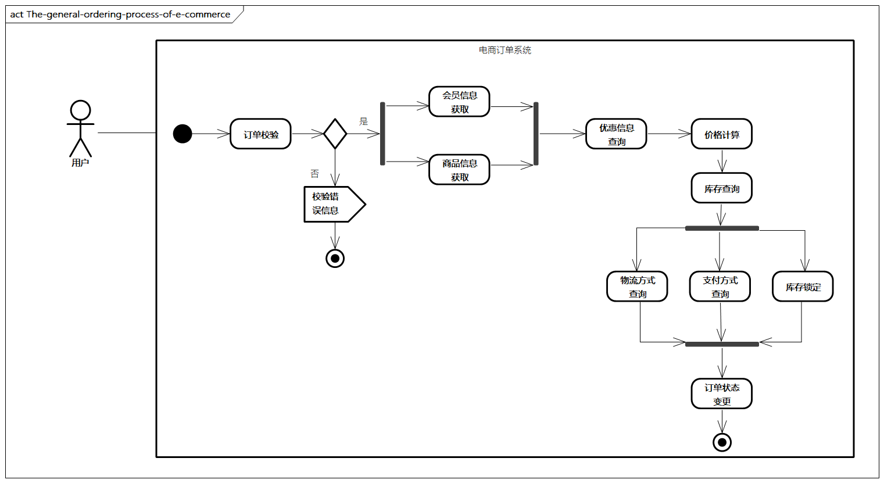

> 图例：电商系统下单通用流程

如上图所示，在电商系统中，下单是比较标准化的流程，包括订单校验、商品信息获取、会员信息获取、优惠信息查询、价格计算、库存查询、物流方式查询、支付方式查询、库存锁定、订单状态变更，最后完成下单操作，而这其中的每一步可能涉及不同的部门或者组织。

> 当然，不同的电商系统有不同的活动和顺序，如有的还需要风险控制，有的需要先进行库存锁定再计算价格，有的在下单过程不需要考虑支付方式，而这些流程就是企业特有的核心业务逻辑。

### 业务流程设计原则

- **整体性原则**：业务流程需要以企业业务战略为导向，流程的设计与运行不能束缚于部门的界限，需要从企业总体视角出发。
- **面向客户原则**：流程设计需要从客户需求出发，从业务本身的痛点出发，以一种简单、便捷、体验良好的路径来实现。
- **灵活性原则**：业务流程中的活动的衔接机制应该是松耦合的，并可以根据企业内外部环境的调整快速变化，如可以通过配置、流程扩展等达到快速变化。
- **价值性原则**：业务流程需要面向业务价值，企业应对流程中不增值的环节进行最大化合并和优化。
- **标准化原则**：业务流程在设计过程中需要考虑输入、处理、输出的标准，标准化更易于实现流程间的衔接与交互。

### 业务流程理论参考

关于业务流程的理论很多，比较著名的有`PCF`、`BPMN`、`SIPOC`、`ARIS`、`IDEF3`，下面我们一起来看看这些理论。

#### PCF

`PCF`（`Process Classification Framework`，流程分类框架）是由美国生产力与质量中心（`APQC`）提出来的。它是一个**通用的流程管理分类参考，提供了一定的流程管理和改善标准**。

`PCF`将运营与管理等流程汇整成12个企业级流程类别，每个流程类别包含许多流程群组，共计1500多个作业流程和相关活动。

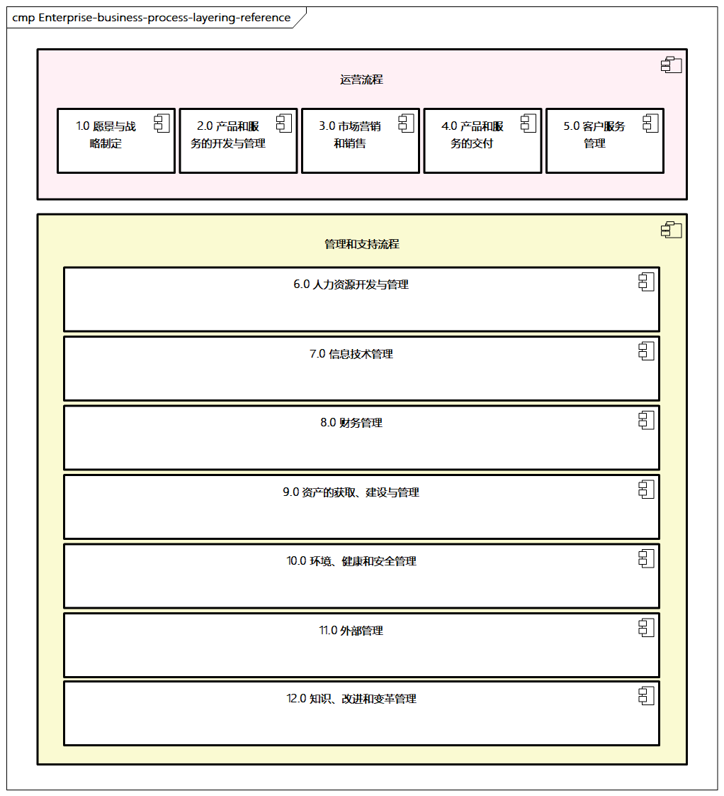

> 图例：PCF业务流程分层参考

`PCF`把流程进行了分层，分为流程类别、流程群组、作业流程和作业活动。

- **流程类别**：第一层级，最高阶的分类项目，如上图的2.0产品和服务开发与管理
- **流程群组**：第二层级，隶属于流程类别的特定流程领域，如产品和服务开发与管理中的2.2服务合同管理。
- **作业流程**：第三层级，一般标准的作业流程，如2.2.3服务合同审批流程。
- **作业活动**：第四层级，组成作业流程的一系列相关活动，如2.2.3.1确定合同模板。

基于这种分层参考，下面我们一起来看看企业中的不同流程分类。图4-15所示为企业业务流程分层参考，包括运营流程、管理和支持流程。

#### BPMN

`BPM`（`Business Process Management`）即业务流程管理，致力于帮助设计人员识别、描述和分解业务处理过程。

`BPM`强调持续流程管理和运营，需要依据业务活动与其所服务的经营目标的关系，对流程、职责等进行设计，通过流程规范和优化，保证所有活动最大限度地支持企业最终的价值目标。

`BPMN`是用来描述`BPM`的工具和理论，目前由对象管理组织（`Object Management Group`，`OMG`）进行维护和管理。

`BPMN`是一种图形化的建模工具，提供了一种简单易懂的方法，目前比较流行的版本是`BPMN2.0`。

`BPMN2.0`包含三种主要视图。

- 协作视图（`Collaboration View`）
- 流程视图（`Process View`）
- 编排视图（`Choreography View`）

`BPMN`通过流程描述了一项具体工作所需进行的有序活动。流程定义由一系列执行语义的活动、事件、网关和顺序流等元素组成。

协作视图通常包含两个或两个以上池（`Pool`），代表相互协作的参与者，一个池可以包含多个泳道（`Lane`）。

在相互协作过程中，参与者通过消息流（`Message Flow`）进行交互。编排视图关注参与者的消息交互。

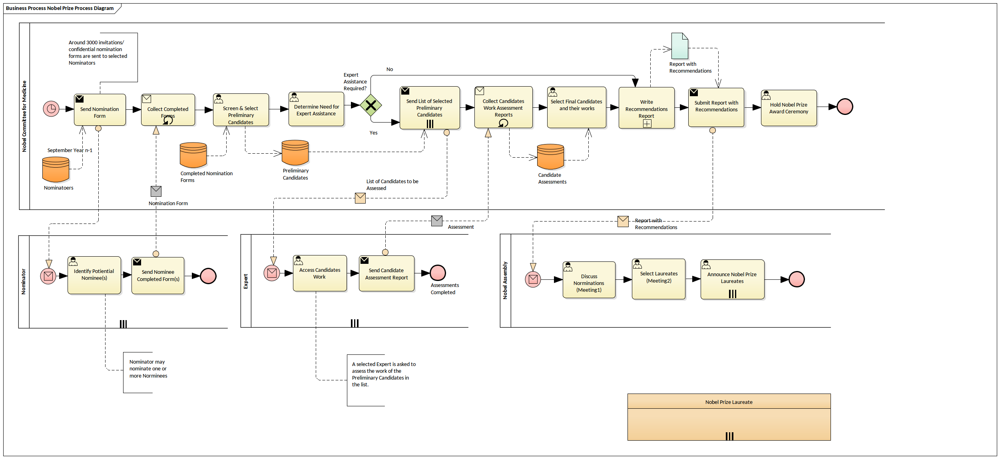

> 图例：BPMN流程图示意

#### SIPOC

`SIPOC`中的各个字母代表供应者（`Supplier`）、输入（`Input`）、流程（`Process`）、输出（`Output`）和客户（`Customer`），此模型由质量大师戴明提出，是常被用于流程管理和改进的模型之一，也可以帮助企业识别核心过程。

`SIPOC`的具体内容如下所示。

- **供应者**：向核心流程提供关键信息和其他资源的组织。
- **输入**：供应者提供的资源等。
- **流程**：使输入发生变化，成为输出的一组活动。
- **输出**：流程的结果和产出物。
- **客户**：接受输出的人、组织或流程，也包括内外部厂商。

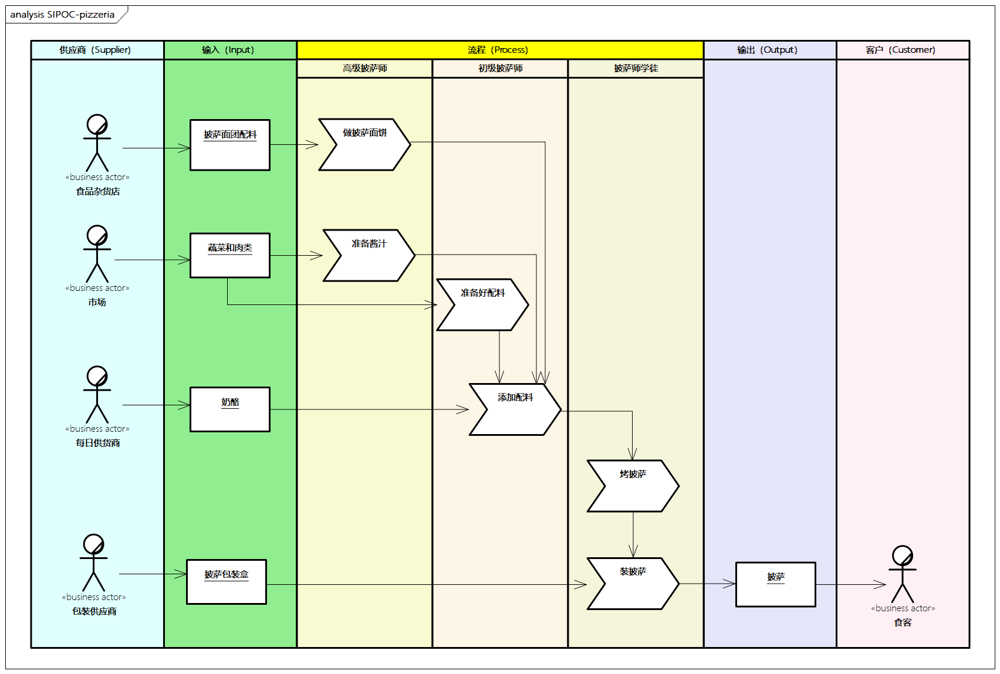

> 图例：披萨店SIPOC示例

**SIPOC有助于进行跨职能部门流程的分析，有助于构建全景视图，可以帮助企业改善工作流程，找到低价值活动并加以改进**。

> SIPOC提供了一个高层次的流程设计方法，企业可以先设计出流程的各个步骤，再设计出流程的主要输出物，以及这些输出物的使用者和后续流程，进而识别对输入和输出的要求，最后确定输入物的供应者。这些步骤对后续的企业IT架构是非常好的输入。

### 业务流程生命周期管理

业务流程的生命周期管理非常重要，很多企业对业务流程进行了一定的管理，但不太深入，缺乏对流程设计、运行的有效控制和管理，需要进行流程建模和建立监控的机制。

这里提供一个通用的业务流程生命周期管理方法，包括业务活动分析、业务流程设计、业务流程模拟、业务流程运行、业务流程监控和业务流程优化。

- **业务活动分析**：将**业务能力进行分解和细化**，抽取出**业务能力组件中的业务活动**。业务活动粒度与范围可以参照企业原有业务活动的范围。
- **业务流程设计**：将**分解的业务活动按照一定的处理逻辑进行组合**，将业务活动视为业务流程设计的组成部分，选取不同的业务活动与不同的组合方式完成不同业务流程的设计。
- **业务流程模拟**：将设计后的业务流程**归置于不同的业务场景进行模拟运行**，通过改变业务流程的输入或者改变业务流程的处理方式，**对业务流程进行测试**，并对业务流程在运行中的处理逻辑、岗位、操作标准、信息传递给出**清晰的定义**。
- **业务流程运行**：与对应后续**应用和系统建立初步的关联关系**，初步确定应用需要具备的主要功能，给予应用架构足够的输入，进而确保业务流程可以正常运行。
- **业务流程监控**：业务流程运行一段时间之后，需要**建立相应的运行指标**，以分析是否符合预期，哪里存在效率优化点，是否达到预期性能指标，从而找出不合理之处。
- **业务流程优化**：将监控中**不合理之处反馈**出来，并通过**优化机制，提出改进方案**，展开下一轮流程的优化设计。

业务流程是不断循环迭代的过程，因此**要考虑系统落地、版本迭代等与后续应用架构、技术架构的衔接**；同时在企业战略计划、业务能力有所调整时，业务流程也需要做出相应的调整。

### 业务流程设计

#### 基于价值链的设计

这种方法主要是从价值链的角度进行业务流程的分解。流程设计需要遵循价值链活动，制定统一的流程层次。业务流程可以分解为不同的级别，一般分解为1～5个级别。

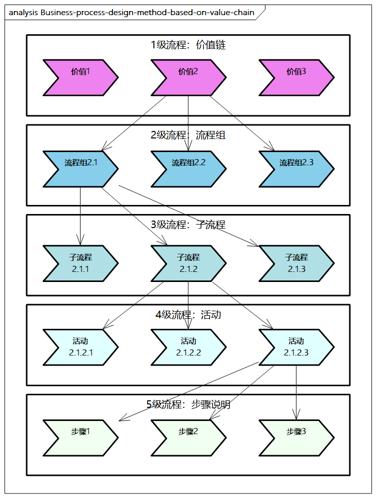

> 图例： 基于价值链的业务流程设计方法

- **1级流程**：价值链，最高层次的业务流程，承接企业业务价值链和最高层级的业务组件，每个部分代表一个业务流程链条。
- **2级流程**：流程组，对一级流程模块进行流程分解，是一组流程的集合。
- **3级流程**：子流程，包含具体子流程的组合，对应所产出的相关业务操作。
- **4级流程**：活动，代表流程的行动，体现为业务操作层面的具体动作。
- **5级流程**：步骤说明，完成活动的一系列步骤说明，对应标准的作业指导书（SOP）。

#### 基于业务组件的设计

**不同业务活动之间的不同逻辑组合会形成不同的业务流程**，同时不同的业务活动可以形成不同的业务能力。如果已经对企业的业务能力进行了分析，那么也可以基于业务组件来设计业务流程。

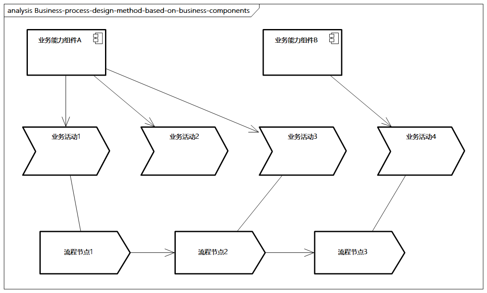

> 图例： 基于业务组件的业务流程设计方法

业务能力与业务流程不是一个维度。

- 业务能力注重能力的体现，不关注具体的流程分解
- 业务流程聚焦流程本身，是面向场景的

> 比如，订单下单的核心流程可能包括订单查询、库存校验、促销价格计算等多个活动，而这些活动可能最终映射到不同的业务能力，如订单履约业务能力、促销价格计算业务能力等。

**业务活动是业务能力组件和业务流程的“基本零件”**。业务能力组件是由业务活动组成的，业务活动通过组件的标准界面与外界交互。业务流程从用户场景出发，将进行各种具体的操作，操作之中包含各种活动。

#### 设计工具

流程图有多种表现形式，如泳道图、`SIPOC`图、`UML`图等，其中比较推荐泳道图。一个流程图可能包含多种元素，如过程、连接、判断、文件、数据、归档、备注，同时可以有多层嵌套和循环等。

流程图可以由多种工具来完成，如`EA`、`PPT`、`Visio`、`Visual Paradigm`、`OmniGraffle`、`ProcessOn`、`IBM WebSphere Process Modeler`等。流程引擎工具有`Activiti`、`JBPM`等。

**强烈推荐采用EA来进行流程设计建模**。

无论使用什么方法和工具，都是为了梳理业务流程、发现流程问题、优化和改进流程，并通过监控反馈，提升业务运营水平和业务架构的设计效率。

### 业务平台

在数字化时代，企业越来越专业化、外包化，**企业通过打造业务平台及生态体系，使内外部业务能力无缝衔接，并通过合作伙伴和客户协作创造价值**。

业务平台帮助企业**基于业务架构进行分步决策，明确业务在哪里执行，由什么类型的团队执行**。在构建业务平台时，我们可以从以下几个层面进行综合考虑。

- **接触客户的程度**：衡量一项业务能力是否需要直接面向客户。企业需要综合考虑多种渠道，如自有渠道、社交媒体、电商平台等，并且结合众多渠道对业务能力进行合理布局，确保客户线上和线下的体验一致。
- **作业量**：从运营作业量的角度来衡量业务组件的作业规模，根据作业量的大小，决定业务组件专业化、自动化及标准化的程度。如果作业量并非非常高，则可以由专业小团队负责。
- **差异化**：衡量一项能力是否是企业差异化竞争力，如果是则需要加大投入，反之则可以采用外部采购或者服务外包的形式。
- **企业特色**：衡量一项业务是企业独有的，还是行业内通用的。企业独有的业务可以提升企业的核心竞争优势，建议企业对其进行资源倾斜，如自主研发、引进专家等。

企业可以根据正在考虑的业务（如价值链、业务能力、业务流程）处于哪个象限，并结合每个象限的设计建议进行分析。

此外，企业可以根据一些要素做进一步分析和调整，如企业的发展阶段、运营成本、风险控制、市场成熟度、政府监管、外包接受度等，综合各种情况进行多维度分析。

根据业务平台分析矩阵，企业可以发现哪些是自身核心竞争力，需要自建自研，哪些不太重要，可以外采外包。

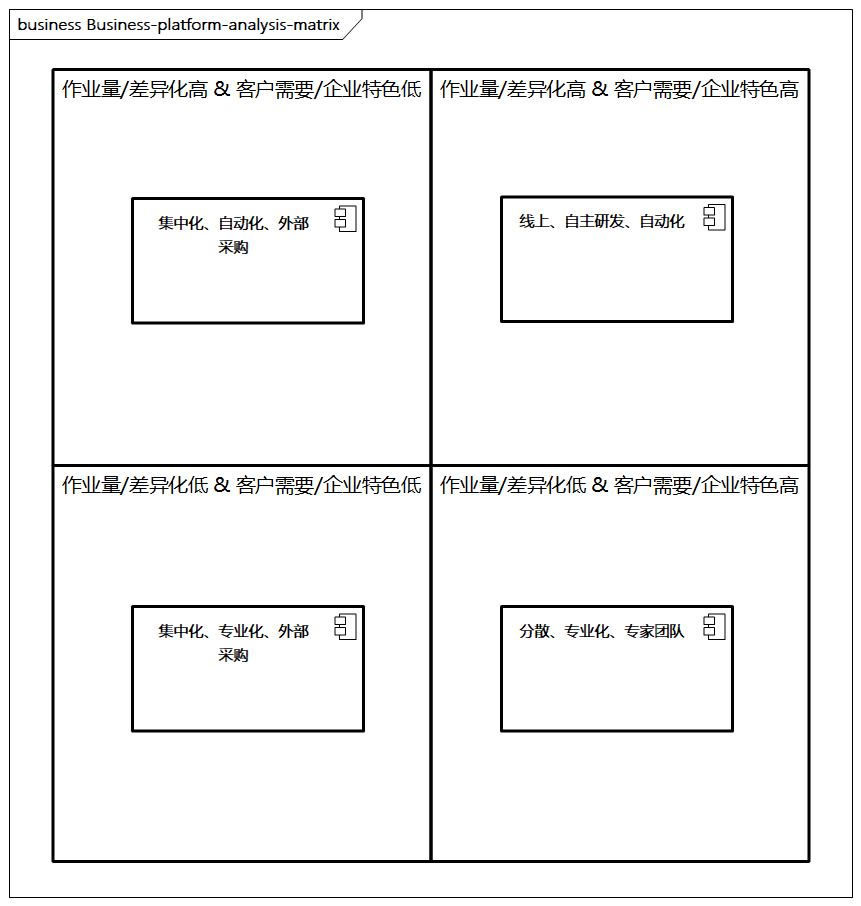

> 图例： 业务平台分析矩阵

如今，一个大的趋势是向线上发展，企业应积极拓展在线平台、线上渠道，构建自营线上营销和电商体系。在制定策略之后，企业要在策略基础上建立制约机制，防止冲突，比如可以建立业务责任制、白名单机制等。

## 组织架构

组织架构是依据企业的战略计划，对企业部门、岗位进行设置，并形成相对稳定的、科学的管理体系，使企业机构能够支持业务流程和企业发展的需求。

组织架构对业务架构非常关键。比如，在业务流程梳理中，需要依据业务流程的运行规律与处理逻辑，在业务流程的各个环节中安排合适的人员，保障组织的灵活性与权责。业务架构也要考虑对应组织的业务需求与发展，对各部门的岗位、人员、角色、权限、职责、考核体系做清晰的定义，保障业务流程中每个节点的权限。

业务架构涉及的核心利益者包括业务战略制定者、企业高层、规划团队、投资与风险控制团队、业务团队、运营团队、IT团队等。从业务架构本身的设计角度而言，其也需要构建专门的团队，相关的人员组成如下。

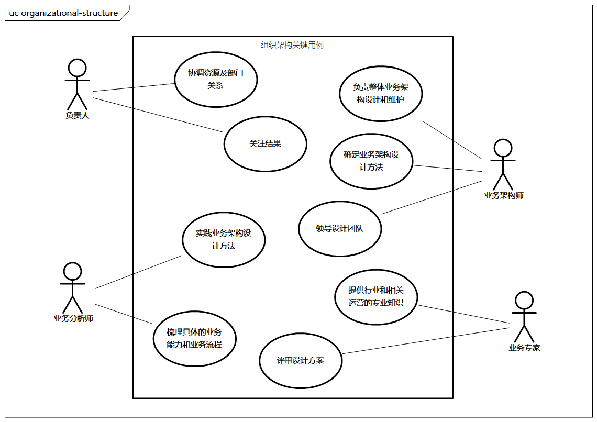

- **负责人**：由企业高层担任，负责协调资源及部门的关系，关注结果。
- **业务架构师**：对整体业务架构设计和维护负责，确定方法，领导设计团队。
- **业务分析师**：实践业务架构设计方法，进行具体的业务能力、业务流程等的梳理。
- **业务专家**：企业内外部的业务专家，提供行业和关于运营的专业知识，评审设计方案。

组织架构的**设计原则**如下。

- 管理明确原则。
- 职责与职权对等原则。
- 有效管理幅度原则。
- 灵活性原则。
- 客户导向原则。
- 执行和监督分设原则。
- 专业分工和协作原则。
- 精干高效原则。
