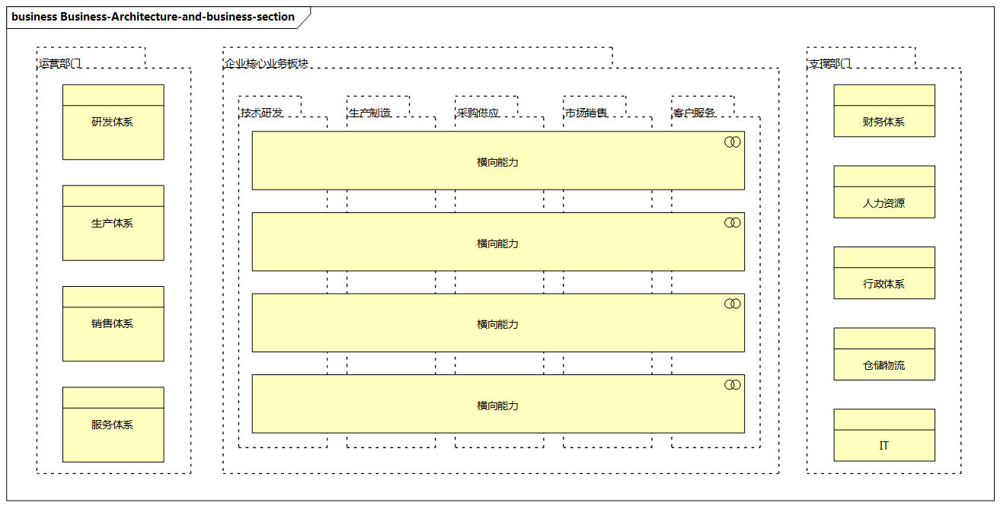

# 业务架构概述

业务架构（Business Architecture）来自业务，我们先来看看什么是“业务”。

- 在百度百科中，业务被定义为“**各行业中需要处理的事务，但通常偏向指与销售有关的事务，企业最终主要以销售产品、销售服务、销售技术等为主要盈利模式。**”
- 在`TOGAF`中，业务被定义为“**任何与产品和服务的售卖相关的组织行为**”。

可以看出，业务最终的目的是“售出产品，换取利润”，**业务是为企业产生盈利的工作和经营活动**，一般指面向客户销售商品。

业务架构是企业架构的基础，它是一个**企业蓝图**，提供一种**业务层面的共识**，是为**支撑企业业务的目标而定义的一套运作管理体系的结构化描述，描述各级组织日常业务运作、模块化和层次化的业务能力结构**，为应用架构、数据架构、技术架构提供指引。

**业务架构与企业战略计划直接相关，是企业战略计划转化为实际项目及日常运营的关键**。

**广义的业务架构与企业的业务板块和组织结构有密切的关系**。

- 涉及企业的核心业务板块，如技术研发、生产制造、采购供应、市场销售、客服服务等纵向业务
- 涉及支撑企业日常运营的运营部门和财务、人力、行政、仓储、IT等支撑部门的横向业务

业务架构可以明确企业人员、资金、信息化、服务等企业资源如何进行部署和分配。

> 图例：业务架构与业务版块

业务架构是基于企业战略计划确定企业各组织部分如何运转的机制，是从战略范畴到战术范畴的转化，是对企业战略计划和业务需求的高度总结。

比如：

- 需要开展什么业务？
- 产品和服务的市场定位是什么？
- 如何进行市场竞争？
- 需要具备什么样的资源、技术等？
- 如何与利益相关者达成一致的业务理解？

这种战略的转化需要**从企业的商业模式及业务价值链进行分析**。

> 现实中，很多企业对业务架构不够重视，要么没有体系化的业务架构，要么将业务架构作为IT的一小部分。
>
> 其实，业务架构在企业架构中承载着非常重要的作用，如果没有一个好的业务架构来准确表达企业的业务，则会对企业数字化转型效果产生很大影响。