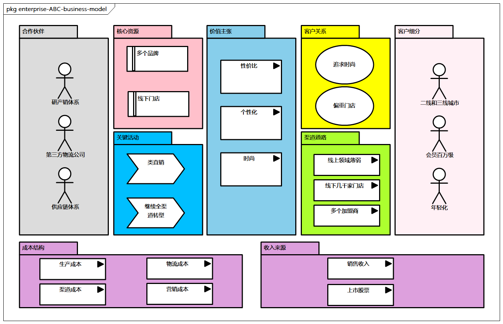
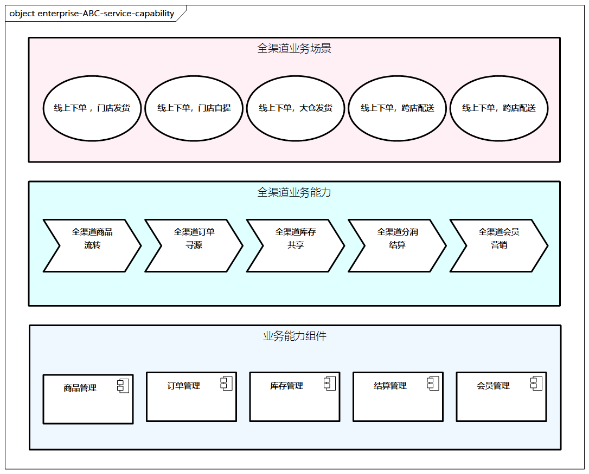
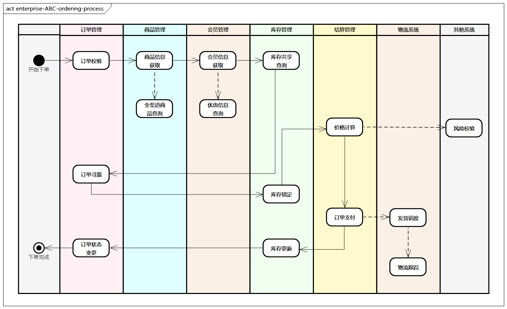
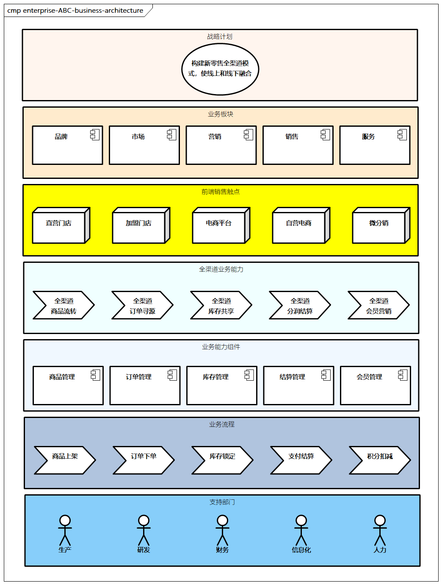

# 业务架构的参考设计

我们继续通过ABC鞋服企业，来看看业务架构在其数字化转型过程中的重要作用。假设该企业旗下有多种女鞋、男鞋、童装品牌，也有自己独立的工厂、物流公司，同时拥有线下门店5000家，由于某些原因，其急需进行数字化转型升级，并且需要我们帮忙其从业务架构视角进行分析和规划。

## 业务调研

首先，让我们向企业ABC的高层及各个部门进行深入的业务调研。通过调研，我们得知企业战略计划，即希望通过新零售的全渠道建设，从市场销售体系出发，利用自身和合作渠道多触点，通过数字化转型项目，打造线下和线上融合，以消费者为中心的新零售模式。

在调研过程中，我们获取了企业的组织架构等信息。通过业务调研，我们还得知企业的核心痛点。

- 线上投入不足，需要大力发展。
- 线下有多种渠道，管理成本高，客户体验不佳，投资回报有所下降。
- 当前库存问题严重，不同区域的库存难以共享，有的店铺库存积压严重，有的店铺缺货断码，库存信息不准确。
- 目前的会员体系薄弱，缺乏统一的会员体系。
- 业务割裂问题，缺乏端到端在线连接，比如存在商品信息割裂问题。
- IT系统问题，有多个“烟囱式”系统，在关键节假日有宕机风险。

## 分析商业模式

> 图例： 企业ABC的商业模式分析

接下来，我们基于战略计划和核心痛点进一步分析商业模式，在此过程中我们分析了商业画布九宫格。**企业ABC的核心商业模式是全渠道的建设**。

什么是全渠道呢？**全渠道是为了满足客户在任何时候、任何地点，采用任何方式购物的需求，采取线下渠道和线上渠道融合的方式销售商品或服务，为客户提供无差别的购物体验**。

我们重点来看看企业ABC现在的渠道。

- 线下渠道主要分为直营、联营、代理加盟等多种方式，主要需要考虑与加盟商之间的利益分配问题；
- 线上渠道主要分为第三方平台、自建App等，企业ABC线上领域比较薄弱，在直播电商、微分销、自营电商方面非常乏力。

## 分析业务能力

经过全渠道商业模式的分析，企业ABC进一步识别了一些核心的业务能力，当务之急是将线下和线上业务一体化，即通过统一盘货、统一订单、渠道一体化、统一结算，使传统零售在“人货场”得到最大化延展。经过分析，我们得出企业ABC业务能力示意。

> 图例： 企业ABC业务能力示意

接着我们对企业ABC全渠道需要的业务能力进行分析，然后对这些能力进行组件化的描述，主要集中在商品、订单、库存、结算、会员管理等方面。全渠道业务能力包括以下几项。

- **全渠道商品流转**：需要共享给各个销售渠道，不同的商品设置不同，企业需要管理参与门店、参与商品，需要提供商品生命周期的管理。
- **全渠道订单寻源**：需要确定不同渠道的订单如何流转，从哪里履约发货。需要统一管理线下和线上的所有订单，并通过一系列可配置的派单寻源规则，综合考虑派单规则。
- **全渠道库存共享**：需要建立多层的库存管理体系，提高库存统一周转和服务效率，支持多渠道库存实时共享，以防止商品超卖。
- **全渠道分润结算**：需要分析多种类型的结算规则，统一制定分润标准，在会员归属方、销售方、平台方、收款方、发货方中，对不同场景确定业绩提成或者归属原则。
- **全渠道会员营销**：需要打造线下和线上一致的会员体验，建立会员等级制度及权益制度；营销活动统一管理、优惠券统一发放及核销等。

## 梳理业务流程

接下来，我们对企业ABC的业务流程进行了梳理，此过程涉及客流、信息流、资金流、物流、商流等多种流程的梳理。

> 比如:
>
> - 商品相关的供应商管理、门店管理、线上商品类目管理；
> - 信息流相关的信息提供、单据流转、服务支持等；
> - 物流相关的仓储、库存、运输、履约等；
> - 资金流相关的支付、账户、结算等。

在这些流程中，比较关键的是核心交易流程、门店管理流程、履约支付流程、运营管理流程、逆向退款和退货流程等。

这里我们以核心交易流程为例，其核心是通过订单校验，商品和会员信息获取，同时进行库存共享查询、订单寻源，进而进行库存锁定、价格计算，之后完成订单支付，再进行库存更新和订单状态变更。在此过程中，其他系统（如风险控制、物流等）通过异步传输方式进行交互（图中虚线部分），最后完成下单。

> 图例：企业ABC下单流程示例

## 明确业务架构

进而，我们进行业务架构的梳理，一般包括梳理当前和目标架构，以及周边关系等。

这里主要以目标架构为例，包括战略计划、全渠道业务能力、业务流程等；并将企业ABC的组织结构进行了展示，包括业务板块、支撑部门及前端销售触点。

> 图例：企业ABC业务架构示例

这里展示的是顶层业务架构，也可以将其进一步细分几个层次，并进而通过评审，与企业架构委员会和各业务负责人沟通和讨论，最终确定业务架构，为后续企业架构及项目实施提供关键的业务输入。

至此，企业ABC的业务架构已初步完成。当然，业务架构是一个非常复杂的过程，一些大型项目可能需历时数月，内容也更加细致，并且会经过多次迭代和优化。这个案例没有涉及所有设计方法细节，感兴趣的同学可以在具体的项目中加以尝试。
