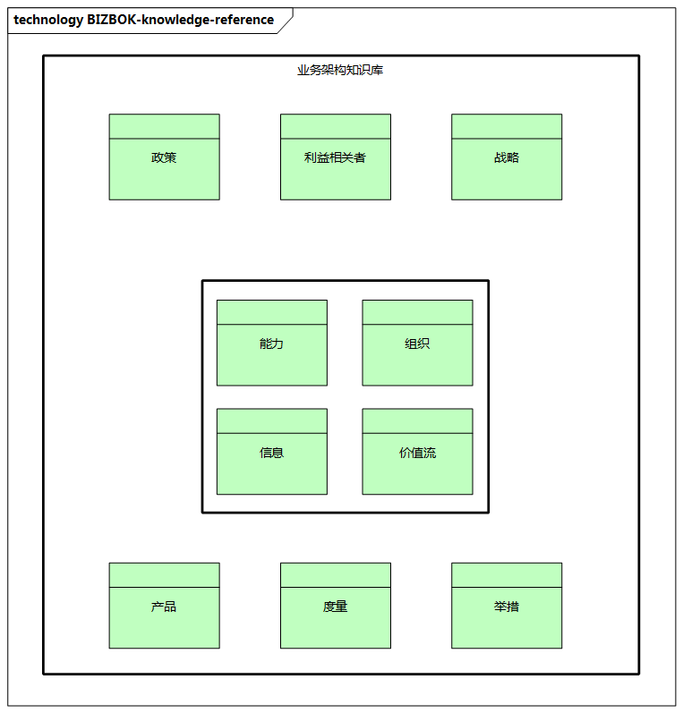

# 业务架构的理论参考

业务架构是一个整体性、全局性的蓝图，涉及企业业务的方方面面。

在传统的企业架构分析中，业务架构可以从一些方面进行业务的梳理和架构设计，如:

- 企业的产能（如产能、批次）
- 设施（是集中还是分散）
- 技术（是采购软件还是自己研发）
- 平台（如资源成本分析平台）
- 人力（如员工的技能）
- 生产安排（如库存调度）
- 质量体系（如质量保障体系）
- 组织（如组织的“权责利”）
- ......

在经典的`TOGAF`框架中，业务架构主要包括以下四个部分。

- **战略目标**：可以采用综合平衡计分卡，将战略目标、KPI、绩效考核作为业务架构战略目标的载体。
- **业务组件建模**：是业务架构设计的起点，将一个企业所涉及的全部业务活动进行组合，是对企业中复杂的业务流程与海量数据的业务活动进行的简化。
- **业务流程**：是业务架构分析的核心，提供流程分类框架，分为战略层、运营层和支持层三大类，进而按照价值链、业务域、逻辑关系层与活动层进行逐步设计，是`TOGAF`架构的流程支撑与载体。
- **组织架构**：是企业的“骨骼”，是企业的运筹体系，是实现转型的组织保障。在业务架构设计中，除了要明确企业的部门、岗位、职责，还要明确组织与业务和职能之间的关系，建立对应的矩阵。

> 业界有一些关于业务架构的研究理论，其中BIZBOK是一种通用的业务架构方法，介绍了业务架构的知识体系，由The Open Group进行开发和维护，在国际上有不少企业应用，不过国内企业应用得还比较少。

> 图例： BIZBOK业务架构知识参考

业务架构基础，是业务架构的核心内容。

- **能力**（`Capabilities`）：企业做什么？
- **信息**（`Information`）：使用什么词汇？
- **组织**（`Organization`）：企业如何组织？
- **价值流**（`Value Streams`）：企业如何向关键利益相关者提供价值？

业务架构扩展信息，将为业务提供更大的洞察力。

- **战略**（`Strategies`）：企业应如何竞争和发展？
- **政策**（`Policies`）：什么决定了战略、投资和行动？
- **利益相关者**（`Stakeholders`）：谁是内部和外部参与者？
- **举措**（`Initiatives`）：如何实现目标和目的？
- **产品**（`Products`）：为客户提供什么？
- **度量**（`Metrics`）：业务表现如何？