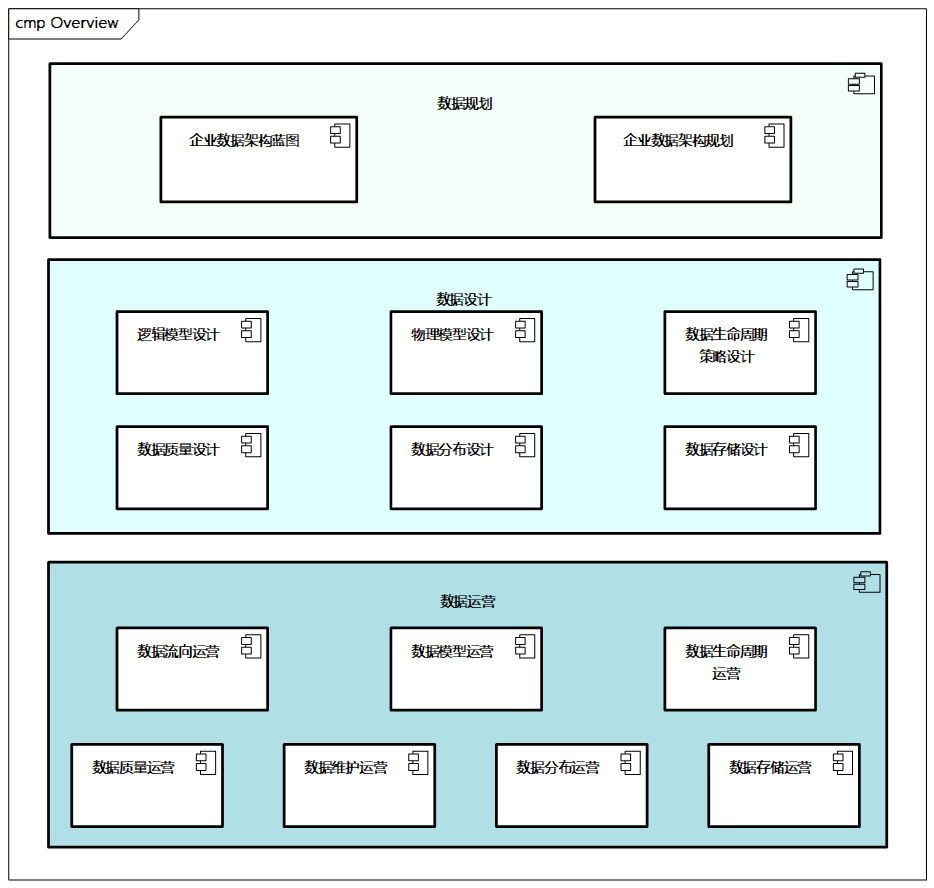
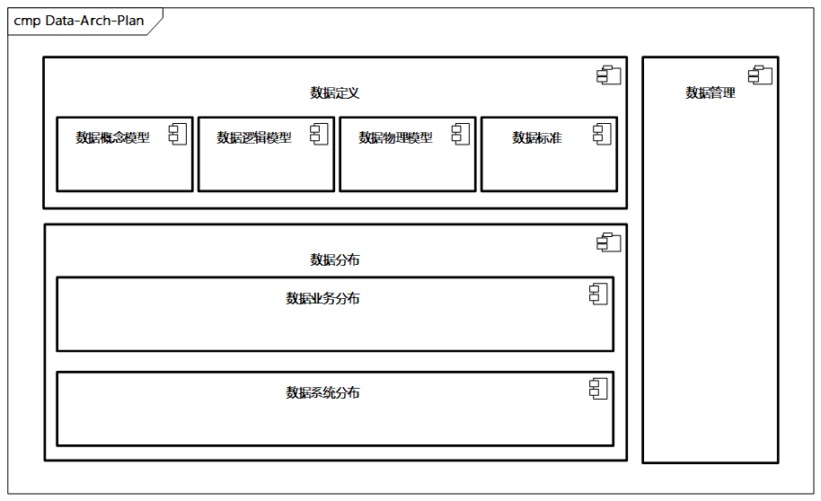

# 数据架构设计

数据架构指的是遵循数据架构设计框架和相关设计原则，对企业的数据资产进行标准化描述，从而提供统一的数据环境和数据化管理框架。

## 数据架构在企业架构中的定位和作用

数据架构是企业架构中的一部分，在企业架构中，数据架构与其他业务和技术架构相整合。

企业架构整合了数据、流程、组织、应用和技术架构，帮助各个组织进行变更管理，提高效率、灵活性，并明确管理责任。而数据架构提供标准、通用的业务术语和字典，表达战略性数据需求，提供高层次整合设计，使战略和相关业务架构保持一致。数据架构在支持整个企业的信息需要时才最有价值。

企业的数据架构整合整个企业的数据并标准化。

## 数据架构全貌

广义的数据架是对数据管理构成要素的有组织安排，能够优化整个结构或系统的功能、性能、可行性、成本。当结构和系统变得复杂时，人员和组织都可从了解架构中受益。系统越复杂，人们通过了解架构受益越多。

狭义中的数据架构是用于定义数据需求、指导数据资产的整合和控制、使数据投资与业务战略相匹配的一套整体构件规范。同时，它也是主蓝图在不同层面的抽象之大集。数据架构包括正式的数据命名、全面的数据定义、有效的数据结构、精确的数据完整性规则，以及健全的数据文档。

数据架构是数据管理框架中非常重要的组成部分，它与数据治理交互并受其影响。

### 数据模型

> 在数据架构中非常重要的事情是梳理出数据模型。

数据模型是数据特征的抽象，是对数据内容以及数据实体和属性之间关系的一个可视化表示，可帮助理解数据如何被组织或结构化创建。其中的数据结构、数据操作、数据的完整性约束是数据模型的关键要素。

一句话总结，**数据模型是现实世界数据特征的抽象**，或者说是**现实世界的模拟，用数据模型来抽象地表示现实世界的数据和信息**。
