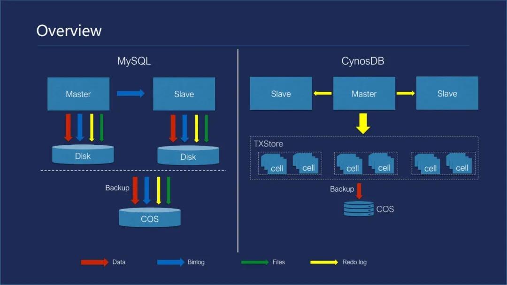

# 云原生时代的数据架构技术体系

## 云原生数据库能力特点

进入云原生时代，数据存储技术也面临着全新的挑战，比如从数据架构维度，如何达到存储和计算分离、支持大规模扩展、支持分布式机制，多服务器安装部署，以及如何达到高可用、机制弹性、资源高效利用。

从技术维度，云原生数据库还需要具备以下能力。

1. **多模**：多种存储方式，多种查询接口和标准，均由同一套数据库引擎来支撑。
2. **智能化和自动化**：借助机器学习、人工智能技术，与数据库内核进行结合。
3. **软硬件一体化设计**：将软硬件结合在一起，发挥系统的优势。
4. **行存与列存一体化**：将行存和列存结合起来，在一套系统里实现行列混存。
5. **弹性扩容**：使得存储和计算可以实现独立扩容。
6. **分布式能力**：数据库分库分片，有需要时只需要增加节点，需要处理分布式事务等技术。

云原生数据库需要应对上述的挑战，当前云原生数据库的典型代表有阿里云的`PolarDB`和`AnalyticDB`、AWS的`Aurora`、`Snowflake`等。

## `PolarDB`介绍

`PolarDB`是阿里巴巴自主研发的关系型分布式云原生数据库，兼容`MySQL`、`PostgreSQL`、`Oracle。`计算能力最高可扩展至`1000`核以上，存储容量最高可达`100TB`。

`PolarDB`采用存储和计算分离的架构，计算节点共享一份数据，提供秒级故障恢复、全局数据一致性和数据备份容灾服务。`PolarDB`既具有商业数据库稳定可靠、高性能、可扩展的特征，又具有开源云数据库简单开放、自我迭代的优势。

## 扩展阅读

- [终于有人把云原生数据库讲明白了](https://segmentfault.com/a/1190000040725523)