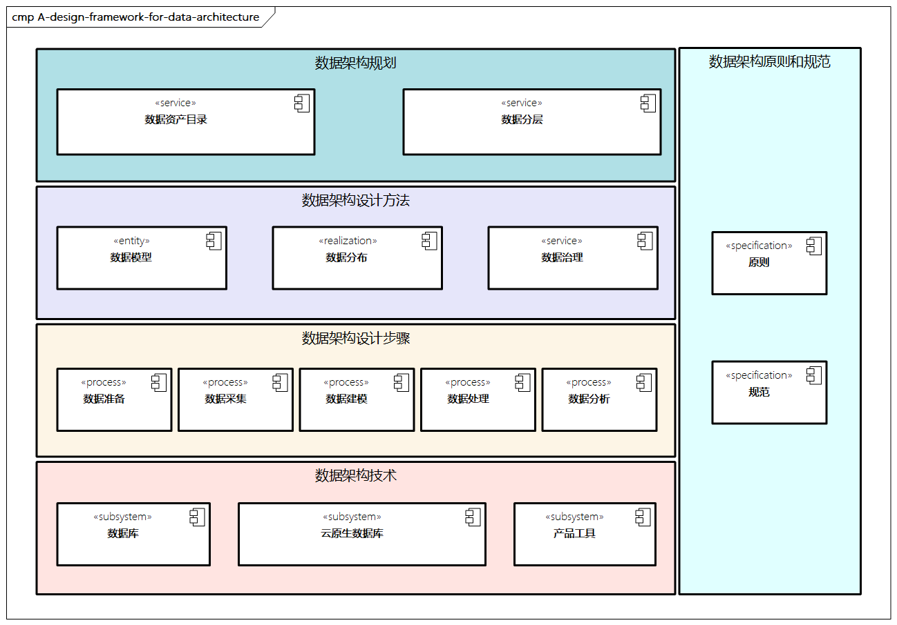

# 数据架构的设计框架

数据架构注重从总体上规划企业的数据资源，比如数据架构规划、数据架构设计方法、数据架构设计步骤、数据架构技术及数据架构原则和规范。

> 图例：数据架构的设计框架

- **数据架构规划**：对企业数据资产进行梳理，形成数据资产目录，同时对业务流程和领域模型等进行数据映射，通过顶层的数据分层规划，实现与其他架构的松耦合和数据共享、复用。
- **数据架构设计方法**：包含数据模型、数据分布和数据治理，构建统一的数据体系。
- **数据架构设计步骤**：进行具体、可实操的数据准备、数据采集、数据建模、数据处理及数据分析，并且应按步骤进行。
- **数据存储技术**：包含数据存储的相关技术选型，比如数据库、存储、云原生数据库、相关产品工具等，本质上属于技术架构体系，由于与数据架构紧密相关，因此也放在数据架构的设计框架中。
- **数据架构原则和规范**：比如存储选择、数据库设计、数据开发治理规范、参考行业模型等，提供指导和约束。
