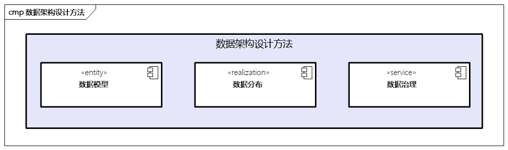

# 数据架构设计方法

数据架构的目的是将企业的数据资产进行有序管理，从而充分发挥数据的价值。在实践中，数据架构需要做好三个方面的工作，即数据模型、数据分布和数据治理。

> 图例：数据架构设计方法

## 数据模型

数据模型是描述数据与数据之间关系的模型，包括数据概念模型、数据逻辑模型、数据物理模型。数据模型需要遵循数据标准，数据标准包括元数据标准和对应的数据模型标准。其中，定义良好的元数据和数据模型是实现数据共享、一致性、完整性与准确性的基础。

### 元数据定义

- 元数据是描述数据的数据，描述数据之间的定义和属性，比如数据库的元数据有表、列、行、字段等，定义企业最重要的内部基础数据类型。
- 元数据可以帮助我们定义数据的模型标准，包括业务元数据、技术元数据、管理元数据等。
- 元数据管理是为了厘清元数据之间的关系，元数据管理可以进一步分为对元数据的获取、存储、维护、分析、质量管理等。

> 元数据在业界有很多研究，比如`FEAF`中就对元数据的参考模型给出了定义，同时在低代码领域，基于元数据的编程也是非常重要的话题。

这里我们先看看`FEAF`中对元数据定义的一种标准参考，其将元数据分为三个标准领域。

- **数据描述（Data Description）**：对数据的统一描述，支持数据的发现和共享；核心的元数据包括实体、关系、属性、数据类型、数据资产等。
- **数据上下文（Data Context）**：对数据进行归类，便于数据的发现，支撑数据资产定义；核心的元数据包括主题、数据资产、分类法、数据资源等。
- **数据共享（Data Sharing）**：支持数据的访问和交换；核心的元数据包括提供者、使用者、交换包、数据定义等。

### 数据模型定义

数据模型是数据架构的核心，针对组织、人员、客户、供应商、财务等元数据确定业务定义和规则、编码规范、数据类型、数据格式，保证最重要的数据准确、完整和一致。企业应集中进行数据的清洗，并以服务方式把元数据传送给对应的应用系统。数据模型可以通过E-R实体关系图来进行建模，实现对数据及其关系的表述，可以指导IT的开发，是从应用架构的领域模型到系统数据层面转化的基础。

数据模型包括概念数据模型、逻辑数据模型、物理数据模型。

- **概念数据模型**：根据实体及实体之间的关系，从宏观角度分析和设计的企业的核心数据结构。
- **逻辑数据模型**：根据逻辑数据实体及实体之间的关系，准确描述业务规则和领域模型的逻辑关系，定义相应的数据来源及相关维度关联。
- **物理数据模型**：按照一定规则和方法，将逻辑数据模型中定义的逻辑数据实体、属性、属性约束、关系等内容，转换为数据库可识别的实体关系。

数据模型在定义过程中要注意以下几点。

- 数据模型与领域模型有对应关系，但并不是一一对应的。**数据模型主要从数据的角度出发**。
- **数据实体不能脱离业务或者应用独立存在**，特别是概念数据模型和逻辑数据模型。
- **数据实体设计尽量遵循第三范式**。每个数据实体的属性不要重复定义，不应包含其他数据实体中的非关键字类型的属性，特殊场景除外。
- **多层数据要进行一体化设计，元数据管理和数据模型管理融合**，数据同时需要不断地持续迭代。

## 数据分布

数据在业务应用的数据流全景视图中，重点关注数据的分布关系，比如典型的数据源分布、信息流、数据流，以及业务流程和应用能力是如何通过数据进行联动的。

- 一方面，企业需要分析数据对应的业务，即分析数据在业务各环节的创建、引用、修改和删除的关系
- 另一方面，企业需要关注数据在单一应用中的数据结构与各功能模块之间的引用关系。

在数据分布中，一个比较重要的话题是数据存储。企业数据有不同的类型，需要不同的数据存储、一致性事务要求、数据库查询操作能力等。

> 比如，结构化数据采用关系型数据，非结构化数据采用NoSQL类型，同时还有文档类型、图数据库、列式数据库、分析型数据库、搜索引擎数据库、时序数据库等多种类型，同时随着云原生的兴起，云原生数据库也是一种趋势。

## 数据治理

数据治理是IT架构治理的组成部分，承担着明确数据治理主题和责任机制、建立数据治理标准，并通过管理制度和流程控制加强对数据生命周期全过程管理的职责。数据治理主要包括以下几个方面。

### 数据标准管理

建立一套符合自身实际，涵盖数据定义、业务操作、应用功能多层次数据的标准化体系。数据标准可以分为以下三类。

- **基础类数据标准**：在日常业务开展过程中产生的具有共同业务特性的标准。
- **指标类数据标准**：满足内部管理及外部监管的要求，在基础数据基础上按统计、分析规则加工后的可定量化的数据标准。
- **专有类数据标准**：在细分业务经营及管理分析中涉及的特有数据。

一个结构化且全面的数据管理方法可以促进对数据的有效使用，过程中需要关注元数据及相关的应用组件是否被清楚地定义，重要的业务活动和应用组件是否都构建了数据标准，应用之间信息交换和数据转化的复杂程度是否可以覆盖等。
此外，标准需要涵盖对质量的管理，具体包括以下几个方面。

- **准确性**：在接入、转换、分析、存储、传输、应用流程中不存在错误。
- **完整性**：数据库应用或所有记录、字段都完整存在。
- **一致性**：在整个数据库的定义和维护方面，确保数据在整个过程中是一致的。
- **时效性**：数据与真实业务应用同步在时间容忍度（数据的更新频度）内。
- **可靠性**：提供数据的数据源必须可靠、稳定。

### 数据生命周期

数据需要考虑完整的生命周期，并根据相应的标准规划进行细化，相关的生命周期需要重点考虑以下阶段。

- **数据生成及传输阶段**：按照标准生成数据，保证数据的准确性和完整性。数据传输过程中要考虑保密性和合规性，防止数据泄露或被篡改。
- **数据存储阶段**：关注保密性、完整性、可用性和一致性，操作要由数据的Owner（所有者）部门来执行。
- **数据处理和应用阶段**：分析、处理数据，以挖掘有价值的信息，保证数据的安全，只输出分析后的结果。
- **数据迁移阶段**：制订合理的迁移计划，提供有关数据转换和清洗等方面的指标，同时需要考虑新系统上线的数据割接应急方案。
- **数据销毁阶段**：主要涉及数据的保密性，此过程需要采用必要的工具，要有完整的记录。

### 数据服务管理

**数据服务是为了更准确地向边界提供数据访问和分析能力，从而用企业内部多年的数据沉淀反哺应用业务系统。** 这需要企业对数据进行深度加工，包括通过各种报表、工具来分析数据，通过建立统一的数据服务平台来满足跨部门的数据流转，提高处理效率。

在此过程中，企业需要**重点关注数据对外呈现的接口规范**，比如数据统计维度的规范、数据展示统一框架、数据发布与共享模式等。这种数据接入方式可以**防止数据重复录入和冲突**，并且通过数据同步、数据维护、备份恢复、数据上传方式的机制**保证了数据的准确性和可靠性**，同时提供访问控制策略和数据共享策略，对数据与外部系统的交换进行规范和控制。

### 数据安全管理

**数据安全至关重要，进行数据安全管理可以保障企业的核心数据资产不被泄漏。** 企业在进行数据安全管理时需要关注以下方面：

- 数据**使用的安全性**，比如数据访问的操作权限，应用通知权限、数据水印、数据印章等；
- 数据**隐私**问题，比如敏感信息的脱敏
- 数据**操作入口统一**，比如单点登录
- 数据**安全合规**，比如数据审计、数据合规
- 建立**安全管理制度**，比如数据安全管理规范、隐私管理办法、管理决策审计
- ......
