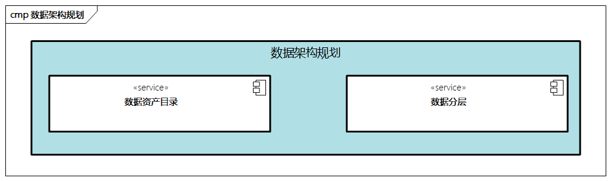

# 数据架构规划

**数据架构规划是从企业整体角度出发，基于战略目标、业务架构及应用架构的规划输入，进行数据架构规划的过程**。

数据架构规划主要包括**数据资产目录**和**数据分层**两部分。

> 图例：数据架构规划

## 数据资产目录

通过对企业各部门及各业务的数据资产的梳理，初步构建企业的数据资产目录，对数据进行分类和定义，建立数据模型，在数据资产目录的梳理过程中，可以结合业务活动及领域模型，构建出基于数据的主题域。其中包括：

- 主题域分组
- 各个主题域
- 对应的业务对象
- 相关数据实体和属性
- .......

形成数据资产目录雏形。

## 数据分层

我们可以进一步根据企业的特点，对数据资产进行分层，合理的分层对于数据架构十分重要。一些常见的数据分层思路如下所示。

- **结构化数据与非结构化数据**。结构化数据是有固定格式和有限长度的数据，是企业应用系统管理的核心数据资源，一般由数据库来管理；非结构化数据是不定长、无固定格式的数据，比如企业管理的制度规范、技术文档等，一般OA或者知识管理类系统，以及半结构化数据，如CSV、日志、XML、JSON等格式的数据。
- **企业级数据与应用系统级数据**。从数据建模角度看，企业级数据主要作为企业的数据标准，包括概念数据模型和逻辑数据模型两大类，定义核心业务实体、实体之间的关联关系、相关的业务规则；应用系统级数据是在某些应用或系统中相对具体的数据。
- **元数据和过程数据**。元数据又称主数据，是企业业务中相对静态、不变的实体信息描述，是业务运行所必需的关键信息；过程数据通常指的是在业务流程中产生的记录业务变化的数据，进一步还可以分为OLTP（在线交易类型，如交易订单状态）和OLAP（在线分析类型，如用户购买行为的分析）等类型。

下面我们来看看一些常用的数据分层参考。

### 从数据处理过程角度进行分层

从数据的处理过程角度，可以分为不同的层次。

- **数据采集层**：把数据从各种数据源中采集和存储到数据存储器上，过程中涉及转移、交换、选择、过滤和清洗等手段，包括数据分片、路由、结果集处理、数据同步等。
- **存储分析层**：包括OLAP、OLTP、实时计算、离线计算、大数据平台、数据仓库、数据集成、数据挖掘、流计算，涉及结构化数据存储、非结构化数据存储、大数据存储等。
- **数据共享层**：涉及数据共享、数据传输、数据交换、数据集成等。
- **数据应用层**：涉及应用系统、产品功能、领域模型、实时查询、数据接口等。

### 从云计算角度进行分层

从云计算的微服务角度，数据可以分为`IaaS`、`PaaS`、`SaaS`等类型。

- `IaaS`：提供基础设施服务能力，比如数据库、存储、网络、物理硬件等，更加考虑成本性能、稳定性、易维护性、准确性等。
- `PaaS`：提供基础应用平台，比如数据一致性事务框架，微服务调度管理、消息收发，以及共享服务的能力提供，更加考虑稳定性、通用性、完整性等。
- `SaaS`：负责对外部提供业务服务，比如基于共享服务的编排组合，对外API透出，更加考虑用户角度的灵活性、易用性、适用性等。