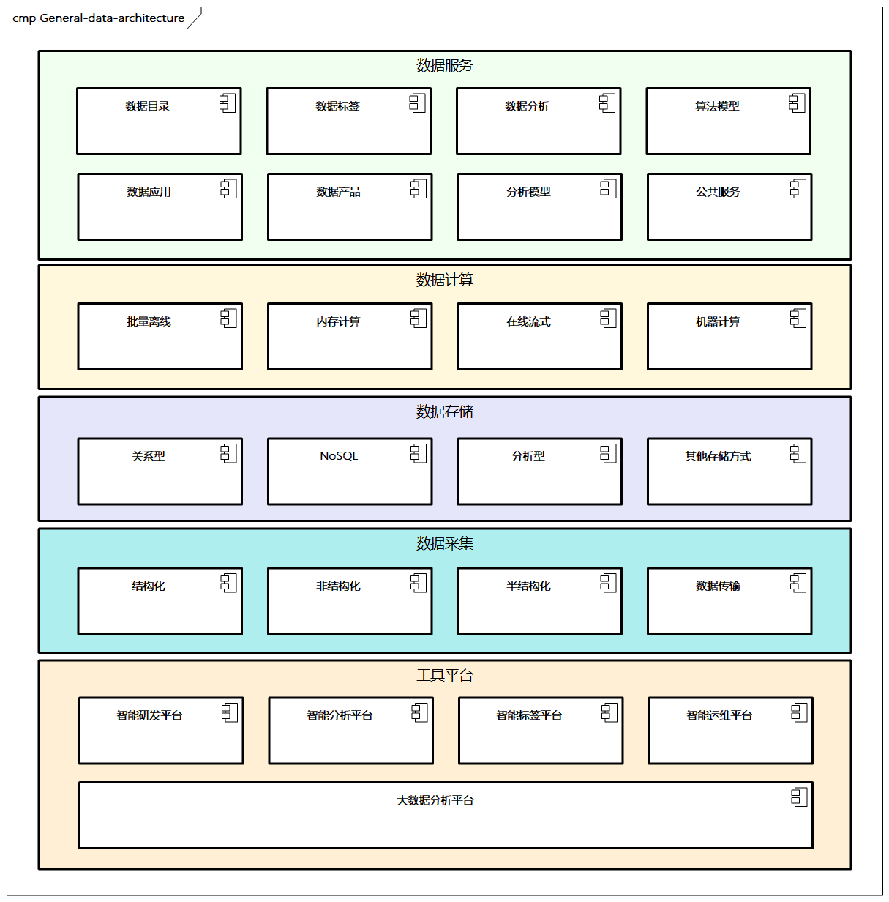
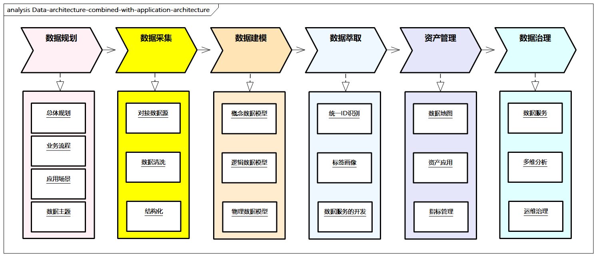

# 数据架构参考实践

## 通用数据架构

这里给出一个通用的数据架构以供参考，如图6-6所示，通过分层的视角列出了一些相对核心的层次，每个层次的内容并不固定，我们需要根据具体的业务和数据需求进行调整。

> 图例：通用数据架构

- **数据服务**：**构建数据服务层，通过接口服务化方式对外提供数据服务**。比如对应的数据目录、数据标签、数据分析、算法模型（如智能补货算法、信用风险模型、商品推荐模型、客户留存模型、转化漏斗算法），并结合相应的数据应用、数据产品和分析模型，**提供对应的公共数据服务能力**。
- **数据计算**：**数据只有被整合、计算才能被用于洞察规律、挖掘潜在信息，实现数据价值**，可以包括批量离线、内存计算、在线流式、机器学习等。
- **数据存储**：**支撑数据的数据库及存储技术**，包括关系型、NoSQL、分析型、其他存储方式，具体的分类和选型可以参考本章相关内容。
- **数据采集**：一套**标准的数据采集体系**，包括结构化、非结构化、半结构化数据的采集，还要做好数据传输。
- **工具平台**：需要搭建一些工具或平台，
  - 智能研发平台（从数据开发流程上辅助开发人员进行数据研发，如构建数据模型、算法开发、数据服务等）
  - 智能分析平台（针对数据进行灵活、快速的分析，支持多数据源、多维分析、多图表组件、多用户权限、多屏等）
  - 智能标签平台（进行标签的定义、可视化及相应的管理）
  - 智能运维平台（对工具平台的服务组件及集群节点的健康状态进行监控）
  - 大数据分析平台（构建大数据处理分析能力，包括相应的组件）

## 结合应用架构

在应用架构中，我们介绍了一些[基于DDD的通用应用中心](../app-arch/domain-driven-design.md)，核心是对应的领域模型。在数据架构中，可以很好地承接这些领域模型到数据模型，并逐步形成相应的数据和存储规划。

> 这里需要强调的是，**领域模型和数据模型并不一定是一对一的关系，前者面向DDD的领域实体，后者面向数据规划层面**，比如一个会员积分领域模型，可能对应数据库中的会员积分表、积分明细表、积分快照等多张表。

这个过程也需要结合数据架构设计方法和步骤，对整体数据进行分析，这里推荐结合应用架构进行数据架构。

> 图例：结合应用架构进行数据架构

- **数据规划**：总体规划，根据企业战略计划、业务架构和应用架构相应输入（如业务流程和应用场景），明确需要建设的数据主题域、相关的资源配置、技术选型等。
- **数据采集**：对接相应的数据源，根据对应数据进行基础的采集、清洗和结构化处理。
- **数据建模**：明确对应的主题，同时确定相应的聚合粒度、对应的数据指标、总体规范定义等。
- **数据萃取**：根据数据进行萃取管理，识别统一ID，建立标签画像，进行相应数据服务的开发。
- **数据资产管理**：整合数据服务能力，构建数据地图，并结合资产应用和指标管理体系，沉淀数据模型等关键数据资产。
- **数据治理**：将数据服务进一步标准化、可视化，并经过多维分析和运维治理，对数据的生命周期进行治理。

## 结合数据仓库

数据仓库（`Data Warehouse`）是数据处理、分析的有效手段，有着几十年的发展历史，可以有效地助力数据架构的设计和建设，可以说数据架构的很多理念来源于数据仓库。**数据仓库是一个面向主题的、集成的、反映历史变化的数据集合，用于支持管理决策和信息的全局共享**。

数据仓库的主要功能是将`OLTP`所累积的大量资料，通过数据仓库理论所特有的方法进行分析整理，并提供给`OLAP`、大数据等技术。

在数据仓库中，数据按照功能和量级主要分为四层，**通过不同层次的架构过程实现从数据资产向信息资产的转化，并且对整个过程进行有效的元数据管理及数据质量处理**。

- **操作性数据层（Operational Data Store，ODS**）：面向主题的、集成的、不断变化的数据，是可选部分，具备`OLTP`的特征。
- **明细数据层（Data Warehouse Detail，DWD）**：将来自不同系统的同类数据源按照某种维度进行聚合，形成统一聚合数据，比如将不同电商平台的订单数据聚合，形成宽表。
- **汇总数据层（Data Warehouse Summary，DWS）**：加强指标维度退化，提炼粗粒度常用维度、常用指标的汇总模型；同时根据某一时间内实体的事件轨迹，形成公共主题宽表，比如根据客户属性、购物经历、偏好等形成全面客户洞察。
- **应用数据层（Application Data Store，ADS）**：增加个性化的标签衍生，并基于应用进行数据组装，比如大宽表、趋势指标等应用型数据。

## 结合大数据

数据架构与大数据密切相关，随着大数据技术的发展，**大数据分析能力逐步成为数据架构核心能力**。

大数据**本质上是以一种分治思维把复杂的计算任务分发出去并进行汇总**，主要的流程有：

- 收集
- 传输
- 存储
- 处理
- 分析
- 检索
- 挖掘
- 应用

搭建大数据平台需要考虑解决数据采集的组件、数据处理的计算引擎、各种数据存储组件，以及数据作业调度、权限、安全管理组件等。同时，企业需要对数据规模进行评估，包括数据总体量、数据日增长量、数据存储周期等。

目前，大数据相关技术选择面很广，其中Hadoop生态占主流，比如:

- 数据采集可选择`Flume`、`Kafka`、`Logstash`、`RocketMQ`等
- 数据存储可选择`HBase`、`Ignite`、`HDFS`、`TiDB`、`Parquet`等
- 数据计算引擎可选择`MapReduce`、`Hive`、`Spark`、`Flink`、`TensorFlow`、`Kubernetes`等
- 数据作业调度可选择`Azkaban`、`Oozie`、`Airflow`等
- 数据权限可选择`Ranger`、`Kerberos`等

当然除了这些开源组件，还有很多成熟的商业化大数据产品，在计算性能、运行稳定、技术支撑等方面有很多优势，比如AWS的`Redshift`，阿里云的`MaxCompute`、`DataWorks`等。

同时，大数据对外提供的服务层也有一些工具支持，比如定制报表、智能缓存、事件分析、数据挖掘、智能算法等。比如，可视化BI工具有AWS的`QuickSight`、Azure的`Power BI`及阿里云的`Quick BI`。

**大数据平台本质上是数据架构及应用数据仓库的延伸，目的是构建企业全统通的数据综合体系，向下承接云计算能力，线上提供数据智能化应用服务。它通过数据架构技术，对海量数据进行采集、计算、存储、加工，之后形成标准数据，形成大数据资产，最终形成数据API，为企业和客户提供各种高效的数据服务**。

大数据平台建设的基础是数据仓库和数据中心，并结合大数据技术，更加关注提供给业务的分析型数据服务，如个性化推荐、千人千面等。通过大数据平台的赋能，企业可在全渠道、上下游生态链中用数据指导运营，实现一切业务数据化、一切数据业务化，助力零售数字化建设，比如沉淀消费者画像、精准广告投放、进行品牌数字化，以及利用会员历史数据，分析会员生命周期，实现会员管理数字化。

另外，**数据湖（Data Lake）也属于广义的大数据范畴，数据湖是以自然格式存储的数据的系统或存储库，通常是对象Blob或文件**。数据湖通常是企业所有数据的单一存储，包括源系统数据的原始副本，以及用于报告、可视化、分析和机器学习等任务的转换数据，经过数据抽取、数据解析、数据处理等对外提供数据API能力。

数据湖比较关键的模块有**分布式存储引擎**、**流数据处理引擎**、**分布式计算引擎**。目前，Hadoop是十分常用的数据湖技术，另外商业化的有AWS的`Kinesis Analytics`、Azure的`Data Lake Analytics`、阿里云的数据湖分析（DLA），它们可以支持多种大数据源。

在提到大数据时，也会常常提到人工智能等，结合人工智能可以提供更丰富的数据智能服务和应用，业界比较典型的有机器学习类AWS的`SageMaker`、Azure的`Machine Learning`、阿里云的机器学习PAI；自然语言处理类AWS的`Lex`、Azure的`Speech Services`和`LUIS`、阿里云的机器学习智能语音交互和NLP；人脸图像识别类AWS的`Rekognition`、Azure的`Cognitive Services`、阿里云的人脸识别和图像识别服务等。
