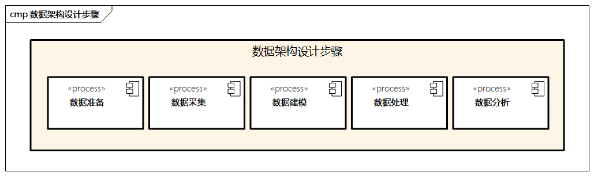

# 数据架构设计步骤

数据架构的设计是一个持续迭代、优化的过程，设计步骤如图所示。

> 图例：数据架构设计步骤

> TODO：每个步骤也整理出一个图出来

## 数据准备

准备阶段聚焦在企业的数据输入，比如数据架构规划、数据资产目录、业务架构与应用架构输入，以及业务数据层面的需求，并确定相应的数据流程；

聚焦于数据流向，需要梳理数据全景图。

此外，数据准备阶段需要确定核心的数据有哪些维度，对应的数据管理者、生产者和使用者，与数据相关的业务和应用边界。

同时，通过数据标准，明确数据层面的数据标准，比如数据接入和生命周期管理规范，定义业务和应用对应的数据术语和统一语言，建议企业内部需要共同遵守的数据规则。

## 数据采集

在数据准备之后，就需要进行数据采集了。

数据采集包括数据源的准备、接入和传输，相关数据的定义，确定元数据及相应的数据含义，确定数据的统计口径；

确定数据的来源；

明确数据的更新频率，是实时更新还是按时更新；数据的更新方式，同时梳理数据相应的主要实体和关键指标，明确数据的范围边界，确保各方使用的数据口径统一。

同时，企业需要考虑技术角度的数据采集效率、准确率和日志记录等方面。数据采集阶段非常重要，它会直接影响数据建模的质量。

## 数据建模

此步骤进行数据模型的建立，包括概念建模、逻辑建模和物理建模，E-R图是比较常用的建模方式，描述数据实体、属性和关联关系。首先，进行概念建模，这个过程主要是自上而下地创建数据模型，从数据全景出发，不局限在具体的主键和字段，注重数据主题域的关系及与领域模型的映射。

其次，进行逻辑建模，详细定义概念模型的业务主键和逻辑主键，对实体属性进行规范。需要注意的是，设计需要遵循第三范式，达到最小的数据冗余。

最后，进行物理建模，通过对数据库的规范，将逻辑数据模型实例化为物理数据模型，根据数据存储介质的不同，需要对物理数据模型进行相应的优化，并对数据进行具体的数据存储设置。

## 数据处理

通过数据建模，我们对数据进行了标准、规范的定义，接下来需要对数据进行处理，一般涉及以下几个步骤。

首先，进行数据抽取，在传统的数据处理中，有ETL（Extract、Transform、Load）等处理方法，过程中需要关注数据操作的幂等性。

然后，进行数据清洗和过滤，数据采集和数据建模的过程一般是不规整的，需要对其中的缺失值、重复、关联等进行清洗，并对过程中发现的异常进行统计和处理，以提高数据的质量。

最后，需要对数据的日志进行分析，比如日志分级、日志标记和告警、日志备份和去重等。

## 数据分析

经过数据采集、数据建模和数据处理后，接下来需要进行数据分析，过程中需要结合行业知识，并对数据进行相应的整合，比如通过相关的数据报表分析、多维分析，建立相应的数据可视化能力，并提高数据的敏捷性，可根据不同视角展示数据的内容，逐步达到可控、可视，提供决策支撑环境，使得数据有效地支持企业决策。

另外，数据分析还与数据挖掘和人工智能相关，企业可以通过大数据算法发现数据的深层次价值。数据分析可以按照独立的数据分析项目来推进，并通过模型和方法的迭代进行优化。同时，数据分析可以借助不同的商业智能（BI）工具进行，同时需要专业人才（如数据分析师）。