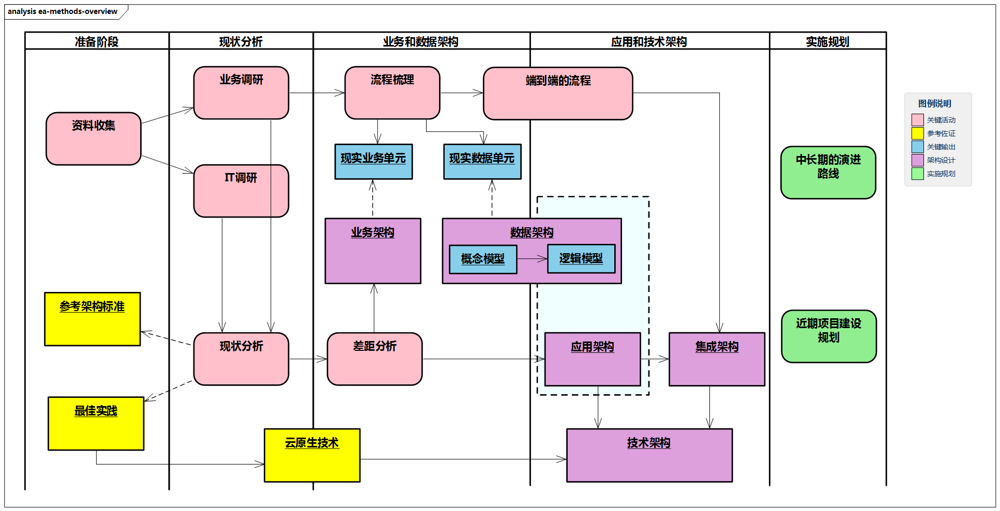

# 企业架构方法论

企业架构的核心是方法体系。本章首先从方法论本身引入，介绍企业战略计划、企业架构规划、项目实施管理、架构运营治理等；然后讨论企业架构与数字化、云原生的关系；最后介绍企业架构实施参考。

> 可以毫不客气的讲，大部分的人是不具备进行全局架构规划能力的，这个一方面是需要你有大量的业务和技术双领域的实践经验积累，是需要你真正做过大型项目的规划并在这个过程中将实践内容，各个架构之间输出关系想清楚。
>
> 系统的学习了类似`TOGAF`的课程当然有用，但这并不代表你具备了企业架构规划能力。
>
> **理论可以指导实践，但是没有通过自我实践证悟的理论没有价值。**
>
> 很多IT顾问完全叫PPT顾问都不为过，完全拿着已有规划模板到处套内容。如果你本身做统一垂直行业，比如拿着某行业的规划输出去给另外一家做咨询。这种长久性基本上还能够像模像样的输出一个规划报告。

但是生搬硬套的最大问题就在于，**你即使有了输出结果，你也无法自己详细论证清楚这个结果是如何分析得来的，即无法自我论证**。

> 比如，我们常说的架构规划里面的这个业务架构图是如何一步步形成的？这些接口你是通过什么方法一步步的分析识别出来的？这些问题大部分人无法清晰回答。

即使对于`TOGAF`，我们也很少从官方材料里面看到类似业务架构，数据架构，应用架构和技术架构之间的内在逻辑联系在哪里。

> 图例：企业架构整体方法论
