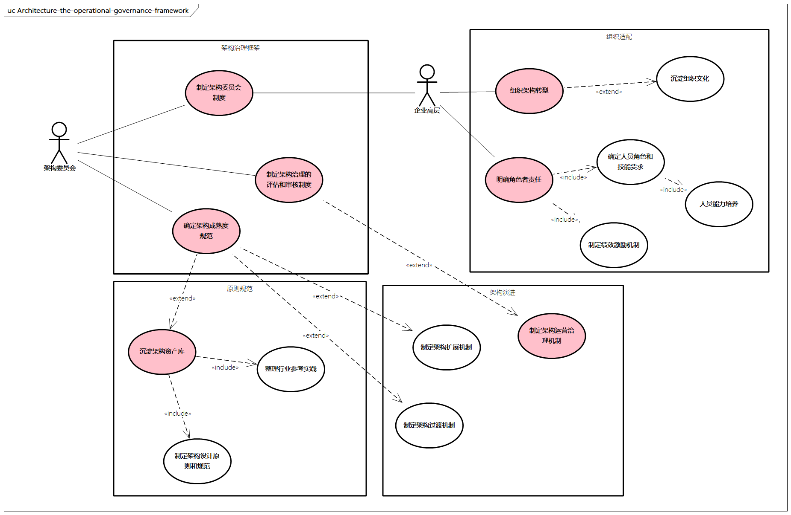
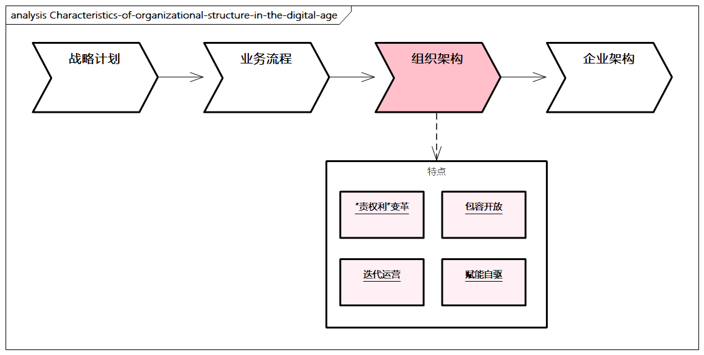
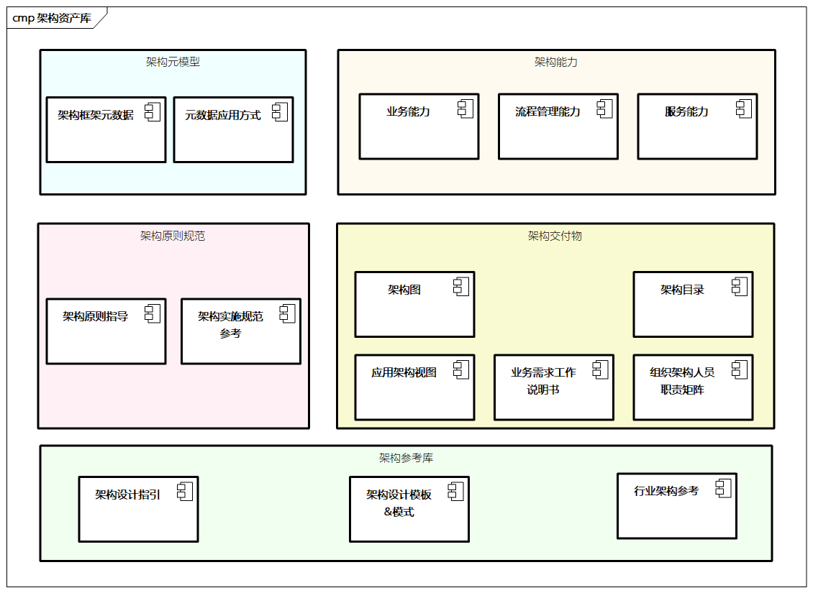
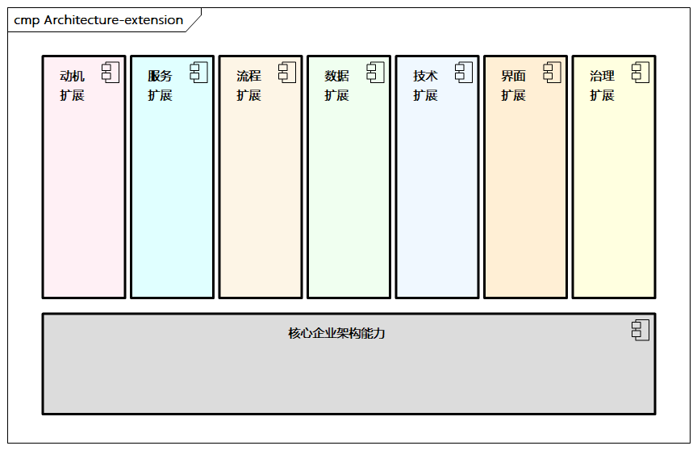

# 架构运营治理

## 架构运营治理框架

>图例：架构运营治理框架

企业架构运营治理对于企业架构的持续迭代和演进至关重要，**企业架构是动态的，需要架构治理的框架，也需要持续迭代的机制**。

架构运营治理框架主要包括以下几个部分。

- **架构治理框架**：主要涵盖架构运营治理的机制，如架构委员会制度、架构成熟度规范、架构治理的评估和审核制度。
- **组织适配**：主要涉及适配企业架构的组织架构，包括组织架构转型、对应的“权责利”的制定、人员角色和技能要求、相关绩效激励、人员培养和组织文化等。
- **原则规范**：架构通过架构资产库进行沉淀，同时制定企业架构的总体原则和相关规范，以及对应的架构行业参考实践。
- **架构演进**：企业架构需要持续演进，通过对应的架构过渡机制、架构扩展机制及运营治理机制，实现架构的动态演进。

**架构治理是在整个企业范围级别针对管理和控制企业架构、其他架构的实践**。它包括以下活动。

- **基于控制论思想**，对所有架构构件和活动的创建和监控进行控制，确保组织内架构的有效引入、实施和演进。
- **实施一个组织体系**，以确保能达到组织内外部标准和要求。
- **建立若干流程**以支持在约定的条件下对上述流程的有效管理。
- **建立并描述影响企业架构的决策结构**，包括架构委员会和相关干系人。
- **建立评估机制**，定义响应的流程、标准、角色和检查点。

### 1. 企业架构委员会

数字化转型需要一个做决策的组织，我们称之为企业架构委员会。

**企业架构委员会主要对运作的条例负责，其需要能够在可能发生冲突的情况下做出决策，并为采纳这些决策的后果承担责任**。

因此，**企业架构委员会应该成为架构中所有关键利益相关者的一个代表，并且通常由一组负责审查和维护整体架构的执行人员组成**。

企业架构委员会的成员需要涵盖**架构、业务、技术和运营**等各个领域。

下面列举一些可以由企业架构委员会负责并承担完全责任的事项。

- 架构及团队分工原则和指导
- 子架构之间的一致性
- 识别可重用的组件
- 企业架构的灵活性，以满足业务需求并利用新技术
- 架构原则的贯彻执行
- 提高团队架构领域成熟度水平
- 确保采用基于架构的开发方法体系
- 为所有关于架构的变更提供决策的基础
- 提供逐步升级的冲突决策机制

### 2. 成熟度模型

**企业架构成熟度模型是一个根据各种选定因素为企业架构进行评估的有效方法**。成熟度的实际水平为企业架构提供了一个**能力测评及用于改善能力的指导方向**。企业架构成熟度模型应该**覆盖企业的各项核心特性**，如业务和技术方面，并且可以根据自身情况进行修改并打造自己的特色。

有了成熟度模型及决策机制，企业就需要在架构治理过程中进行架构评估，确保IT开发项目与架构的一致性。

- 一方面，企业可以**对项目影响进行评估**，来清楚地说明企业架构如何影响组织内的重大项目
- 另一方面，企业可以**对架构进行评估**，具体评估企业架构的适配度

以下是一些架构成熟度模型的参考维度。

- **数字化能力**：业务快速响应、组织适配、数字化运营。
- **架构规划能力**：企业架构方法体系、企业架构完备度、架构资产能力。
- **过程管理能力**：敏捷项目、架构治理。
- **云原生技术能力**：服务治理能力、弹性扩展能力、无服务器化程度、可观测性、稳定性、自动化水平。

### 3. 组织适配

数字化转型的**一个关键是组织架构的升级**，组织架构的本质是**为实现企业战略目标而进行的分工与协作的安排**。

企业的战略商业模式体现为业务流程，而**流程实施的主体是各企业组织，同时组织的形态直接影响企业架构的规划和项目的落地**。另外，组织架构还受企业内外部环境、发展战略、组织规模、人才培养等多种因素的影响。

> 传统企业的组织架构大多属于直线型、职能型、事业部型、矩阵型、网络型。这些组织架构对内的信息流，是自下而上收集，中心决策，自上而下分解，定岗定责，层层回报。

虽然理论上企业的每一个部门组织都为企业的最终战略目标贡献着部门价值，但**实际上看到的更多的是每一个部门组织均从自己部门的利益和角度思考问题**，部门内部的协同、协作还算顺畅，一旦涉及跨部门或组织的协同操作，则效率极其低下，**出现了“部门墙”现象，导致系统“烟囱式”林立，员工排斥创新，互相推诿，不适合数字化转型**。

> 比如，产品设计部门、生产制造部门、市场营销部门各自建设了PLM、MES、CRM系统，在保护企业机密数据的理由下，“烟囱式”林立。

数字化的组织阵型需要**充分协调**架构管理团队、架构师团队、业务团队、IT团队、运营团队、系统研发团队及项目管理团队之间的**分工和关系**。

> 图例：数字化时代组织架构的特点

- **“权责利”变革**：组织更加灵活，企业从组织上进行优化和变革，**打通“部门墙”**。通过企业架构的指引，结合项目实施，构建虚线、实线网格型组织架构，优化KPI绩效考核制度，以最终完成企业战略和业务目标为最终指导原则。
- **包容开放**：优化资源分配、运营协同、激励导向，并通过数字化理念和文化进行导向，过程中**拥抱多元观点，充分沟通和讨论**，突出民主共识及包容开放。
- **迭代运营**：民主共创，探索试错，分步实施，敏捷行动，并通过**小范围、低成本地试点逐步推进，同时积极反思与调整**。此外，企业架构需要持续运营治理，这需要企业对运营非常重视，包括对应的团队配置和人员培养。
- **赋能自驱**：数字化企业架构的落地强调“**多兵种一颗心一场仗**”，团队上下协同作战。个人有强大的自驱力，同时充分与他人沟通，坦诚地向他人提出意见，**在总体价值上达成一致，并以客户为中心，从业务场景出发，端到端地解决客户问题**。

### 4. 原则规范

企业架构需要遵循一些原则和相关规范，原则规范贯穿整个企业架构过程。

架构原则是指导架构决策和流程管理的重要依据，时刻让团队思考如何更好地做好企业架构，如何更好地满足企业战略和业务诉求，如何更好地支撑业务发展。

架构原则还可以分为不同的层面，如关于架构规划的原则、关于架构运营治理的原则等。架构原则的定义包括名称、声明、依据和相关的影响。一个优质的原则应该是易懂、健壮、完整、一致和稳定的。

除了在附录中我们提到的[SOLID原则](../appendix/architecture-principles.md#solid原则)及[正交性](../appendix/architecture-principles.md#正交性)、[高内聚](../appendix/architecture-principles.md#高内聚)、[低耦合](../appendix/architecture-principles.md#低耦合)、[简单适用](../appendix/architecture-principles.md#简单适用)等，这里我们再总结一些通用的企业架构原则以作参考。

- **统筹规划、分步实施**：企业架构要从总体上进行规划，要有统一的战略路线；在项目分解实施时，要根据资源、能力、环境等条件分步骤、有计划地进行。
- **顶层设计、迭代推进**：需要有前瞻性、先进性和整体性的顶层设计，然后在具体实施过程中敏捷迭代，不断反馈。
- **架构先行、实施在后**：企业架构的作用非常重要，需要进行总体的规划，然后实施项目。
- **业务导向、服务载体**：业务是基础，企业各个交付件应以服务为载体、以标准接口交互为手段。
- **技术前瞻、实用为本**：要有先进且实用的技术。技术是工具，业务需求是根本，服务应用是载体。
- **数据贯穿、一致统一**：数据贯穿企业架构的各个部分，不同的架构只是表现形式不同，本质是对同一数据的一致性表达。
- **开发运维、合二为一**：开发和运维要形成统一，交付的是服务而不是产品，二者要共同协调，联合推进。
- **基础抽象、共享下沉**：将业务方面稳定、可靠的基础服务沉淀成共享服务，技术方面应用云原生进行技术能力下沉，如服务流量控制、可观测等。
- **充分沟通、集中治理**：架构要进行充分的论证，开放思想，决策后的架构要集中治理，并且应该符合架构治理委员会的制度规定。

### 5. 架构资产库

企业架构的最终**资产需要进行有效的沉淀**，构建起架构资产库，为整个企业架构提供资产沉淀，也为持续演进提供有效的基础，助力更好地协同。

架构资产库的主要构件如下所示。

> 图例：架构资产库

- **架构元模型**：描述经组织裁剪的架构框架的元数据及相关应用方式。
- **架构原则规范**：描述原则指导、架构实施规范参考等，指导整个架构过程。
- **架构能力**：定义架构的核心能力，如业务能力、流程管理能力、服务能力等。
- **架构交付物**：也叫架构制品，如架构图、架构目录、矩阵、文档等，还包括应用架构视图、业务需求工作说明书、组织架构人员责任矩阵等。
- **参考库**：提供指引、模板、模式和其他行业或者特殊领域的架构参考。

### 6. 架构演进

企业架构是一个动态过程，其中架构治理非常关键。

架构治理有两个指导思想：

- **一是尽可能重用**，在已有的架构能力上扩展或针对特定领域增强，防止重复“造轮子”；
- **二是充分沟通**，清楚自己在整体架构中处于什么位置，需要如何改进，而这种沟通的基础**需要建立一种运营导向机制，以相关指标作为参考**。

在架构演进中，比较重要的是架构的扩展能力，体现架构的通用和开放能力。

架构需要提供基础能力和扩展能力，需要采用一种非常灵活的方式来管理架构，从而使得企业在**不同阶段可以根据自身需要对其进行裁剪和改造**。底层**通过最小集合定义为核心企业架构能力**，并在此基础之上支持后续扩展内容的加入。

除此之外，企业架构能力还可以根据自身特性，在更具深度的层次上定义若干元模型扩展，包括动机扩展、服务扩展、流程扩展、数据扩展、技术扩展、界面扩展及治理扩展等。

> 图例：架构扩展示意

持续演进需要充分沟通，**沟通的一个重要基础是通过运营掌握数据，通过衔接IT架构，再到业务架构的运营、KPI的设定，并对应业务能力和业务场景，进而满足企业的业务战略**。

这个过程需要进行运营团队的建设，其实很多互联网公司除了研发团队、产品团队，**还有一个重要的团队就是运营团队**。运营人员需要有**较强的数据分析能力、团队沟通能力、运营策划能力及数字化能力**。

运营人员需要与业务架构师和技术架构师充分沟通，对业务架构、应用架构、数据架构、技术架构各阶段**应用不同的KPI进行驱动，并通过数据分析进行展示，可视、可观、可测地数字化驱动整个企业架构的运行**。
