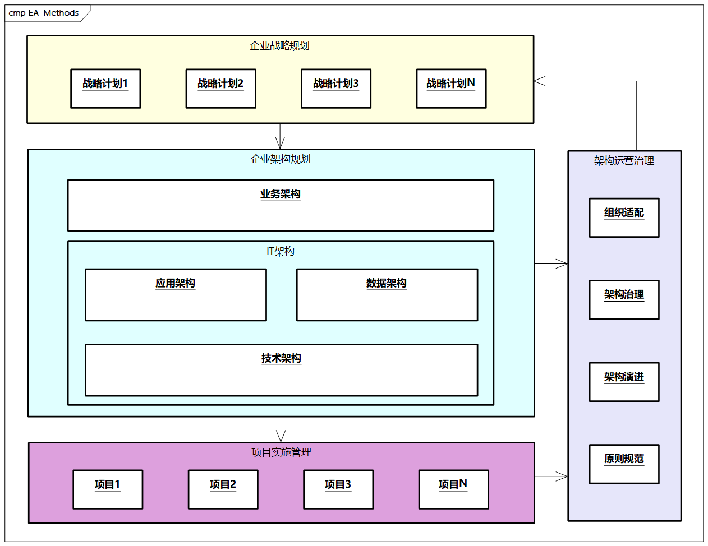
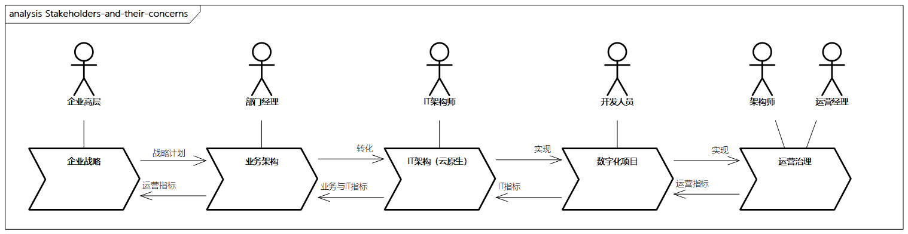
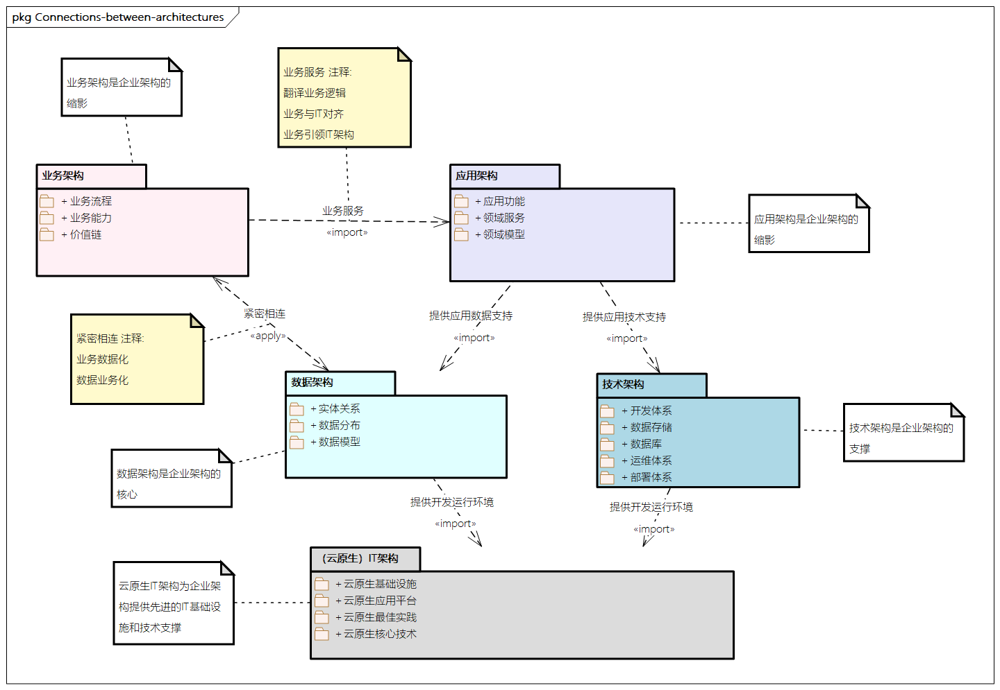
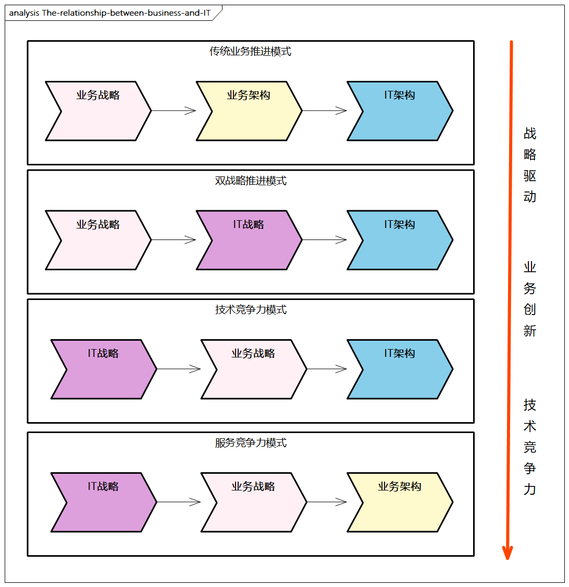
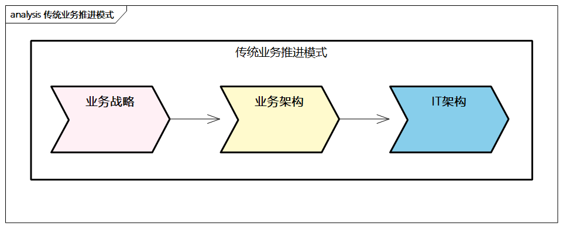
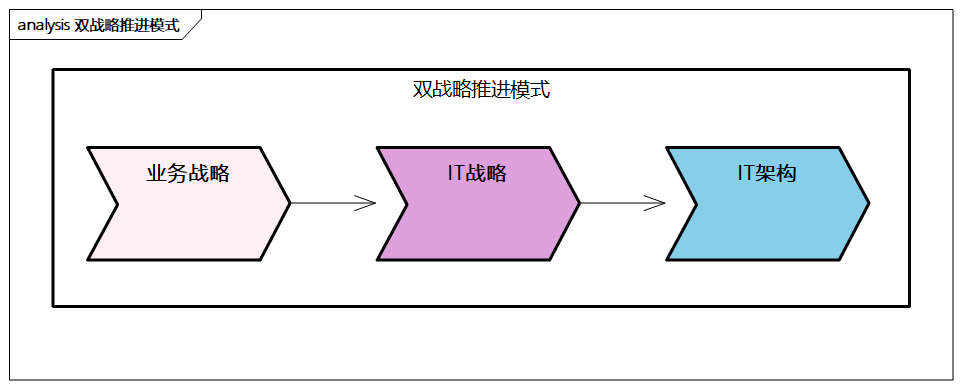
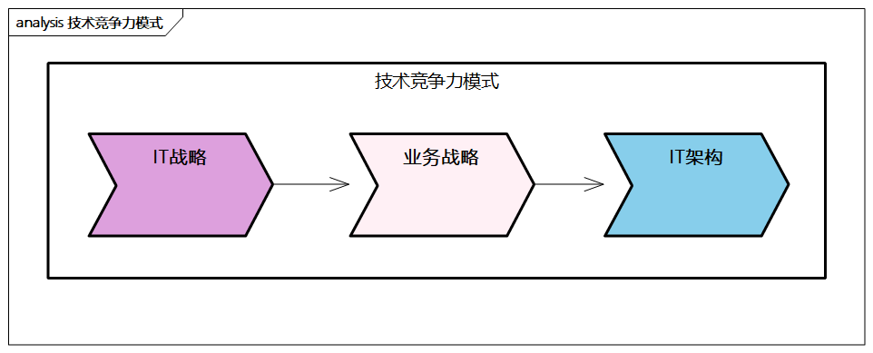
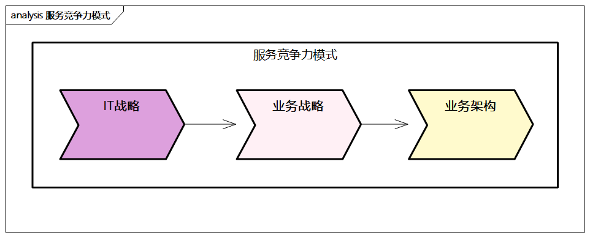

# 企业架构方法论概述

## 什么是方法论

> 百度百科对方法论的定义：方法论，就是关于人们认识世界、改造世界的方法的理论。

**方法论，即“方法”+“论”**。

- 首先，它是**解决某种问题领域的方法的方法**，这个方法更加**体系化**、**全面化**，并且有足够的**通用性**和**普适性**，如前文提到的[Zachman](../ea-theory/zachman.md)、[TOGAF](../ea-theory/togaf.md)等框架理论
- 其次，它是对**事物讨论、分析、总结的过程**，除了照搬公式，更重要的是**讨论的过程**，是可以基于此指导具体参考、可适配和实践的，如设计模式、最佳实践等

**一个好的方法论要对解决问题的方法高度总结和提炼，探讨问题的本质，通过体系化地分析问题，重复讨论内部各种因素的关系和矛盾，并通过相关的指引可以适配到具体子问题领域**。这么看，方法论既抽象又具体。

### 方法论的三种策略模式

方法论需要参考架构的思维模式，如抽象思维、分层思维、多维思维和演化思维。此外，我们可以通过以下三种策略模式来进行分析。

- **自上而下**：**总体规划，分步实**施。这是一种**演绎的方式**，经过从宏观上把握顶层方向，洞察客户背后的本质需求，定义问题，分析问题，然后将具体问题分解为子系统工程实施。
- **自下而上**：**由点到面，步步为营**。这是一种**归纳的方式**，通过用例堆积，分类归纳，逐步扩大范围，在实践中通过试点工程，场景聚焦，积累经验，由个性形成共性，全面推广。
- **上下结合**：**将自上而下的演绎分解和自下而上的试点规划相结合**。这是我十分推荐的一种方式，自上而下关注战略层面，从全局出发，从业务痛点和诉求出发，高屋建瓴；而自下而上关注战术层面，从具体的试点工程进行落地验证，反复迭代并优化整个过程。这是一个**动态的过程**，两个步骤相辅相成，可以交替或者同时进行。

## 企业架构方法论的内容

企业架构涉及整个企业，是一个系统过程，是对企业多层面、多角度地规划和描述，包括企业的关键业务、应用、数据和技术战略，以及对业务功能和流程的影响。

我们可以看出，企业架构可以帮助企业**分析业务与技术的相互影响**，使企业采取适当的行动，帮助企业建立快速响应变化的能力。企业架构可以系统地描述、分析、改变企业的结构和组成，从而达到企业战略目标。在构建企业架构的方法论时，我们需要结合经典的企业架构框架及先进的云原生技术。这里给出企业架构方法论参考，主要包括四个部分。

> 图例：企业架构方法论

### 企业战略规划

企业战略进一步可以**分解为业务战略和IT战略，二者之间互相影响**。

根据这些战略的分析和设计，形成企业战略计划，包括企业的基本**组织框架**、**流程框架**、**业务逻辑框架**，帮助企业找到最为紧迫的业务和信息化痛点、瓶颈问题，并将企业战略计划作为指导**企业架构和项目的重要顶层指导方针**。

### 企业架构规划

企业架构是**连接企业战略计划和项目的桥梁**，有承上启下的重要作用。

- 业务架构用来落实业务战略，包括业务能力、业务流程、业务逻辑等。
- IT架构用来落实IT战略，包括应用架构、数据架构、技术架构。
  - 应用架构涉及**对应业务的领域分析、功能识别、服务分析等**，包括相关的应用、产品、系统和组件等的规划和设计；
  - 数据架构突出**数据模型**，相关的实体、属性、关系等，以及相关的**数据分布和管理**，还包括与**大数据相关的数据分析和运营**；
  - 技术架构是**支撑整个架构体系的技术部分**，包括技术选型、技术体系、研发体系、运维体系等，并以云原生技术架构为指引，支撑整个架构的快速、敏捷、稳定和高效。

### 项目实施管理

**项目实施管理承接企业架构，关系到战略能否成功落地**。

依据企业架构的设计，结合战略计划，分解出若干项目。项目还可以进一步分为管理咨询类项目和IT项目，并根据项目的轻重缓急分阶段实施。

在项目实施过程中，要**分析各项目实施的前提条件、风险、投入和成效**，采用先进的软件工程和项目管理方法，最终实现企业战略和企业架构的落地。

> 如最小可行性产品（Minimum Viable Product，MVP）理念、敏捷开发、DevOps、持续交付等。

### 架构运营治理

**日常运营是架构实施的保障**，企业需要通过运营指标和相关机制来驱动架构的持续演进，并优化和完善架构体系。

架构运营治理需要**建立治理机制，构建架构成熟度模型和评估机制、架构委员会管理机制、架构原则规范制约机制**等。

此外，企业还需要指导企业组织适配，包括相关的能力框架、绩效激励、人员培养，并且需要构建企业架构持续演进的机制，包括架构过渡、架构扩展、持续演进和运营管理。

**架构运营治理既是整个战略计划和企业架构的重要保障，也是企业架构动态化的体现。**

### 方法论内容小结

虽然各个部分的内容不尽相同，但企业架构遵循以下基本的指导思想。

- 识别并定义高层的策略、目标及驱动力。
- 创建针对架构的高层的期望和战略计划。
- 细化战略计划，在业务、数据、应用和技术等层面进行详细描述。
- 对当前架构和目标架构进行差距分析。
- 将差距分析转化为解决方案，进而形成项目规划。
- 应用云原生等先进技术实施并管理这些架构项目。
- 在所有过程中监控内外部环境的变化，通过日常运营和架构治理将变化反馈到架构建设过程中。

## 各部分的关系

> 图例：企业架构中各部分的干系人及其关注点

企业架构向上衔接企业战略，向下连接数字化项目。

- 企业高层关注企业战略
- 部门经理关注业务架构
- IT架构师关注云原生IT架构
- IT开发人员关注数字化项目
- 运营师和架构师等关注架构的运营治理

从运营治理的视角来看，各个层次需要通过数字化运营及相关指标来驱动。

> 举个例子，如果企业战略是**营收增加20%**，那么**实现该目标需要对业务架构进行改造和升级**，比如：
>
> - 增加销售渠道20%
> - 链路成本优化30%
> - 增加创新产品投入30%
> - ......
>
> 进而**通过IT架构和具体的数字化项目进行转化和落地**，比如经过云原生体系上云
>
> - IT成本优化40%
> - 应用研发效率提升30%
> - 核心链路稳定性提高到99.99%
> - ......

需要注意的是，企业架构需要关注业务与IT之间的转化关系，**这种转化通过业务架构来进行驱动。日常运作的流程、IT系统、项目都应该在业务架构的指导下进行**。

> 如果没有业务架构而直接从企业战略到IT系统，就会出现运营与战略脱节、各个业务环节缺乏统一协调等问题。

当然，协调好业务和IT的关系，让业务和IT协调一致，是数字化项目成功的关键。

企业架构中涉及很多领域和概念，覆盖企业活动的整个过程。企业架构中四种架构之间有着紧密的联系。

### 业务架构是企业架构的基础

**业务架构描述了企业的价值链、业务能力、业务流程等。**

业务架构也涉及企业组织和治理间的结构和交互关系；同时关注内外部协作关系，描述企业如何满足客户需求，进行市场竞争，与合作伙伴合作，建立生态体系和运营模式等。

**业务架构是描述从战略计划到企业各部分如何运转的工具。**

业务架构的**输入主要包括企业战略计划、愿景目标、需求痛点、商业模式**等，主要**输出包括业务能力、业务流程**等。

### 应用架构是企业架构的缩影

**应用架构描述了对应的应用及系统的规划和设计。**

应用架构包括应用间的相互关系及核心流程的呈现，应用架构一般通过领域建模来识别领域模型、服务模型，**核心是将业务架构的业务流程和服务翻译成人们可以看懂的应用服务和服务流程**。

此外，应用架构还包括系统、产品、解决方案等层面的系统级抽象。

### 数据架构是企业架构的核心

**数据架构描述了企业架构的数据模型、数据分布、数据资产之间的结构和关系。**

数据架构以业务架构为基础，而反过来业务又通过数据得以体现，也就是“一切业务数据化，一切数据业务化”，**数据通过应用架构进行承载，应用通过数据进行关联**，所以说数据架构是企业架构的核心。

### 技术架构是企业架构的支撑

**技术架构描述了技术体系，包括开发体系、部署体系、运维体系等。**

技术架构包括**业务、数据、应用对应的软硬件能力**，包括IT基础设施、中间件、网络、通信等。

> 技术架构经历了从单体架构、分布式架构、微服务架构到现在的云原生架构模式，支撑整个架构的快速、敏捷、稳定和高效。

### 云原生IT架构提供先进的IT基础设施和技术支撑

云原生IT架构应用先进的云原生核心技术，如容器、微服务、`Service Mesh`、`Serverless`、`DevOps`等，**让整体企业IT架构享受云原生技术红利**，并提供云原生应用平台和对应的基础设施，通过相关的设计模式和技术最佳实践指导企业开展云原生上云及应用升级。

## 业务和IT的关系

**在不同类型或相同类型但不同阶段的企业，其业务和IT在企业中的定位不同**，促使业务和IT之间的关系也有比较大的区别，业务和IT之间的关系大体上可以分为四种模式。

> 图例：业务与IT之间的关系

目前，**越来越多的企业向后两种模式进行转型，突出技术竞争力**。

- 企业高层如果不了解最新技术的发展和应用，则会错失更多的商业机会；而更好地结合业务发展和IT，形成“双螺旋”提升，将赋予企业新的“DNA”，使得企业在数字化时代脱颖而出。
- IT管理者也需要积极、主动推进信息技术的应用，做好业务创新和IT创新的桥梁，提升在管理层中的话语权，助力企业数字化时代转型成功。

### 模式一：传统业务推进模式

此种模式是常见的模式，**企业发展由业务推动，IT支持业务发展落地。组织形态上也体现如此**，如集团、各业务线、IT部门等。传统的零售业、制造业、鞋服业等大部分采用此种模式。

### 模式二：双战略推进模式

此种模式是**业务战略和IT战略并进的模式，是IT作为核心竞争力之一的模式，突出IT战略对业务战略的支撑，强调IT和系统的能力，使IT成为行业竞争的优势，重视IT**。电商行业、新零售行业、金融行业等普遍采用此种模式。

### 模式三：技术竞争力模式

此种模式是企业**把创新IT作为主要竞争力，IT战略影响企业战略，从而影响业务架构模式**。强调科技的互联网企业（如美团、百度、腾讯等）都属于这个阵营。

### 模式四：服务竞争力模式

当**企业IT成为核心业务，并成熟稳定后，IT能力和服务（包括产品及相关的解决方案）可以满足其他企业业务和技术的需求，成为技术服务提供模式**。互联网技术公司大多采用此种模式，如阿里云、腾讯云、AWS、Azure等。
