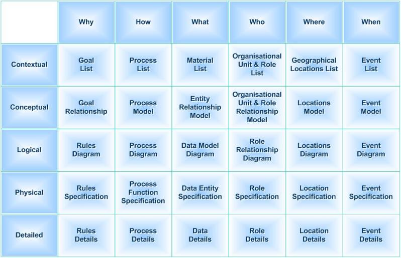
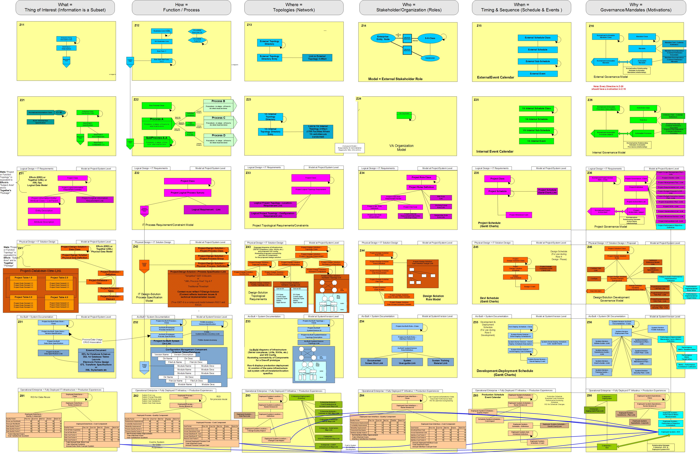

# Zachman Framework

Zachman框架理论被John Zachman于1987年提出，在业界享有盛誉。Zachman框架是一种用于企业描述表示的二维分类方案，它由包含36个单元格的矩阵构成，每个单元格都关注企业的某个特定方面。

Zachman框架以六个典型的沟通问题（何人(Who)、何事(What)、何地(Where)、何时(When)、为何(Why)、如何(How)）作为列和六个视角范围（Scope Contexts）、业务概念(Business Concepts)、系统逻辑(System Logic)、技术物理(Technology Physics)、组件组织(Component Assemblies)和操作(Operations Classes)。

> 图例：The Zachman Framework of Enterprise Architecture

> 图例： VA EA Meta-Model Cell Details Enlarged

## 扩展阅读

- [Zachman Framework - 维基百科](https://en.wikipedia.org/wiki/Zachman_Framework)
- [企业架构 | Zachman - 知乎](https://zhuanlan.zhihu.com/p/83531338)