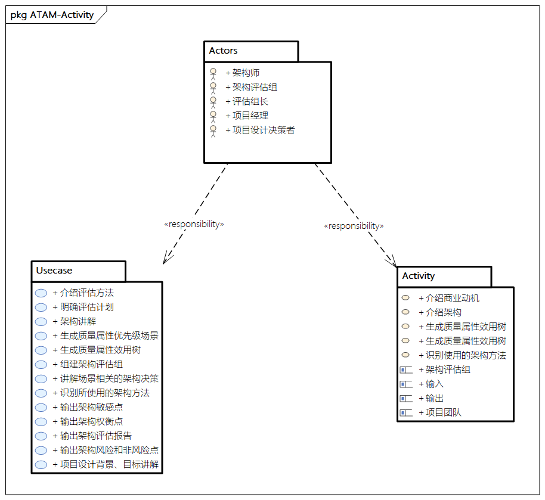
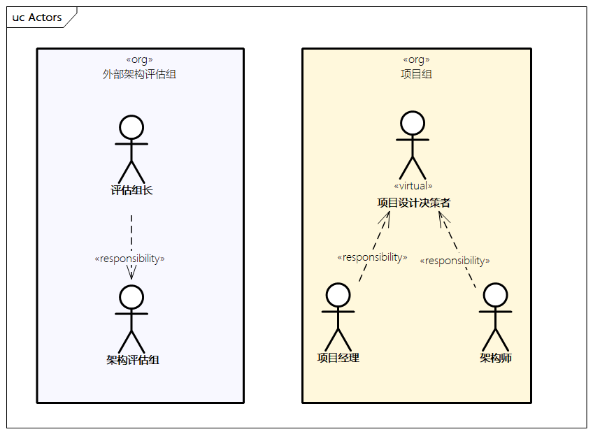
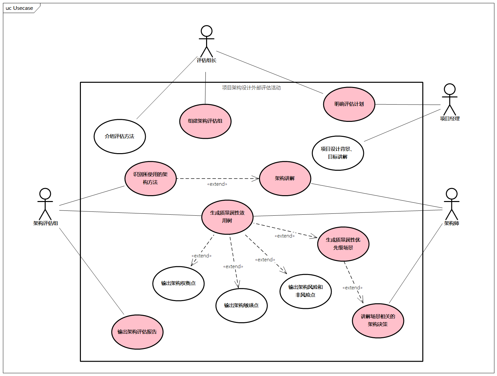
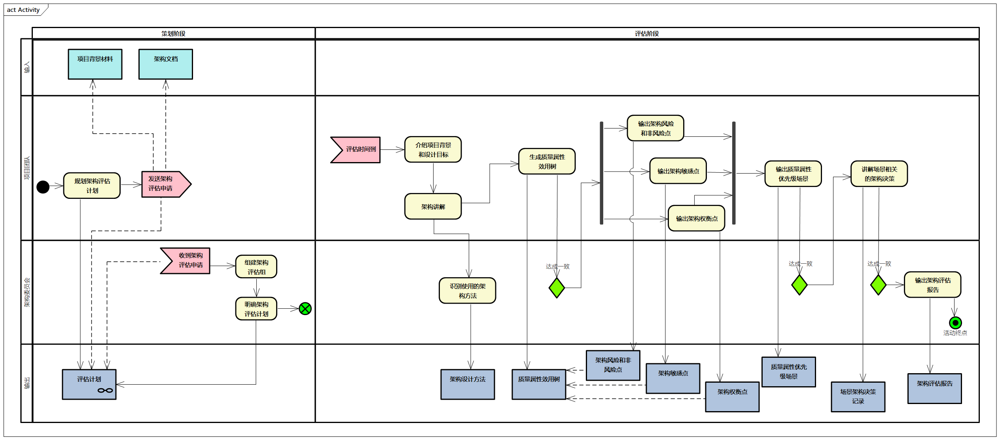

# `ATAM`软件架构评估方法

## ATAM介绍

`ATAM`(`Architecture tradeoff Analysis Method`)是卡梅隆大学软件工程协会提出来的一套架构权衡分析方法。

`ATAM`的评估目的是**根据系统的质量属性和商业需求评估设计决策的结果**。

`ATAM`希望揭示出架构满足特定质量目标的情况，使我们更清楚的认识到**质量目标之间的联系，即如何权衡多个质量目标**。

## `ATAM`评估过程详细描述

ATAM评估方法的的阶段：

第0阶段	建立评估小组， 建立评估组织和待评估组织间的合作关系	
第1阶段	以架构为中心，重点获取架构信息并对其进行分析。	评估阶段，上面的9 个步骤
在这时完成

第2阶段	以风险承担者中心，重点为获取风险承担者的观点，并对第1阶段的结果进行验证。
第3阶段	后续阶段，形成最终报告，对后续活动做出规划，评估组织在此阶段实现文档和经验的更新。	

### 策略阶段

- **参与者**: 评估组长和关键的项⽬决策者
- **输⼊**:架构文档
- **目标**：确定评估的目标、计划、评估组成员
- **输出**: 评估计划: 谁、什么时间、提供什么样子的评估报告

### 评估阶段

- **参与者**:评估小组和项目设计决策者(肯定包括了项目经理和架构师)
- **输出**: 架构简要展示、业务目标、质量属性和相关场景、效用树、风险和非风险点、敏感点、权衡点

1. 介绍`ATAM`方法(评估小组长)
2. 介绍商业动机(项目经理或系统客户)
3. 介绍架构(首席架构师)
4. 识别使用的架构方法(评估小组)
5. 生成质量属性效用树(评估小组和项目设计决策者) 决定性的一步
6. 分析架构方法(评估小组) 确保方法是正确的 获得风险点、非风险点、敏感点和权衡点列表

### Phase 2:评估(2)

- **参与者**: 评估小组、项目设计决策者和架构涉众
- **输出**: 从涉众群体获得的一个优先级场景列表、风险主题和商业动机

1. 介绍`ATAM`方法和之前的结果(评估小组长) 重复以确保涉众也知道方法并回顾分享之前2~6步的结果
2. 头脑风暴、场景划分优先级(评估小组问涉众) 与质量属性效用树进行比对
3. 分析架构方法(评估小组、架构师) 使用新产生的优先级靠前的场景、架构师解释与之相关的架构决定
4. 展示结果(评估小组)

### Phase 3:后续工作 Follow up

- **参与者**:评估小组和主要涉众
- **输出**:最终的评估报告

### `ATAM` 输出

- 架构简要介绍
- 业务目标
- 以质量属性场景表示的带优先级的质量属性需求
- 效用树
- 系列风险点和非风险点
- 风险主题
- 架构决定与质量需求之间的映射
- 敏感点、权衡点
- 最终评估报告

## 评估输出示例

### 业务目标分析结果表

|内容列表|详细备注|
|:-|:-|
|主要业务目标|为企业的商业决策提供数据支持   大批量数据的并发接入、处理和分析 |
|次要业务目标|为外部应用开发的算法／应用程序提供支持  数据的再次处理|
|其他业务目标|采用自动化操作，以尽可能减少操作成本|

### 系统质量属性列表

| 质量属性目标 | 标识号（数字表示效用树中的子序号）|针对质量属性的要求|
|:-|:-|:-|
|可维护性|M1|更改某个子系统时不要求改动其他子系统|
| |M2|把子系统的部署要求分别降到最低|
| |M3| 把回归测试时间从5天减少到1天|
|可靠性| R1 |不至于因为数据输入输出而导致某个系统资源崩溃或等待较长时间，如超过 10分钟
| |R2|请求（输入出）中的某一部分数据错误不会妨碍其他部分的正常使用|
| |R6|因系统崩溃或备份造成的无法提供服务的时间不能超过1小时
|可操作性|O10|系统应该能在20分钟内根据用户类型、数据类型、介质类型、目的地或用户对1000项定单重新设置优先级|
| |O14|应该能在不需要操作干涉的情况下，通过系统API网关为1000个并发请求提供服务|
|可扩展性|S2|能同时支持50个机构|
| |S3|能够支持来自100个数据源的输入|
|性能|P1|在某种查询算法下，可使响应速度能提高5倍|

### 带优先级的质量属性效用树

|第1层：质量属性|第2层：质量属性求精|第3层：质量属性场景|重要性|难度|累加和|
|:--|:--|:--|:--|:--|:--|
| 可维护性 | M1：对一个子系统的更改不要求改动其他子系统| M1.1：部署下一个服务器版本，实现对当前版本的更新。升级应该在8小时以内完成，并且不应影响其他子系统及查找、浏览或预定功能的使用。| 30 | 30 | 60 |
| |M2：独立地回退子系统的部署|M2.1：使服务器从M1回退| 20 | 20 |40|
|可操作性| O10：系统应该能在20分钟内根据用户类型、数据类型、介质类型、目的地或用户对1000项定单重新设置优先级 | O10.1：积压任务管理-- 在系统连续24小时不能正常工作后，应在30分钟内为所积压的任务设置优先级，以保证各任务能够按优先级来进行处理，并能够让正常的操作得以维持| 30 | 20 | 50 |
| |O14：应该能在不需要操作干涉的情况下，通过系统API网关为1000个并发请求提供服务| O14.1：系统在连续24小时不能正常工作时，需要恢复2天内的请求并按优先级进行处理 | 20 | 20 | 40 |
| | | O14.2：接收100个并发查询请求，不拒绝高优先级的请求，在性能允许的情况下完成处理，不使系统过载| 20 | 20 | 40 |
|可靠性／可用性| Ra1：系统中组件的失败的或挂起时间不能超过10分钟 |Ra1.1：系统定时（10s）检查每个组件的健康状态，当一个组件出现健康状态不正常，系统要将该组件重新拉起，让其能正常提供服务| 30 | 10 | 40 |
| 可扩展性|Sc2：系统能够支持50个节点|Sc2.1：跨节点订单可记录50个节点，跨5节点订单历时2分钟。|20|30|50|
| | |Sc2.2：跨节点用户注册在24个小时内经历50个节点。|20|30|50|

## 场景分析表

### 场景描述示例

#### 场景号 M1.1

|要素|描述|
|:--|:--|
|场景（M1.1）|部署下一个服务器版本，实现对当前版本的更新。升级应该在8小时以内完成，并且不应影响其他子系统及查找、浏览或预定功能的使用。|
|质量属性|可维护性|
|环境|常规维护|
|刺激|部署下一个服务器版本，实现对当前版本的更新，并添加对经纬度的支持。|
|响应|升级应该在8小时以内完成，并且不应影响其他子系统及查找、浏览或预定功能的使用。|
