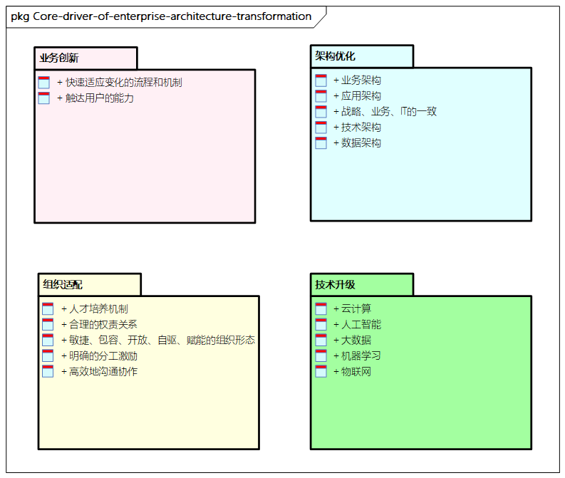
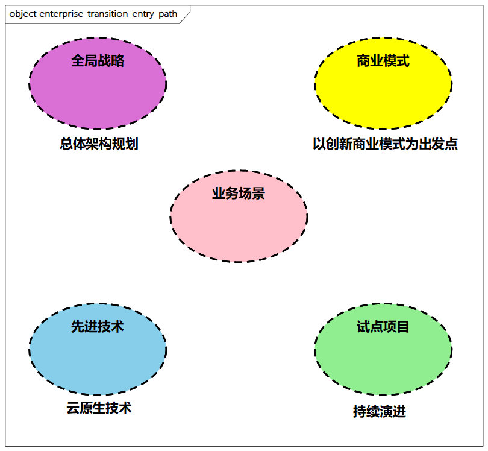

# 前言

## 企业架构的驱动力

在当前的数字化时代中，企业要持续发展必须要进行数字化转型和升级，而转型和升级的关键是驱动企业从业务、架构、技术、组织等方面全面且系统地改造升级。

> 图例：企业转型的核心驱动力

## 企业转型的切入点

在企业改造升级过程中，往往不关注架构设计，或者只关注IT层面，未从企业架构全局视角出发进行设计，特别是未从业务、应用、数据、技术等整体企业架构规划层面出发。

而如何结合企业的战略计划、商业模式，并加上与企业架构相关的整体架构规划，同时IT项目实施落地，并完成架构治理的闭环，是越来越多的企业亟待解决的问题。

> 图例：企业转型的切入路径

通过理论结合实际，综合业界的一些通用知识体系，并融入个人的思考沉淀而成的企业架构设计方法和实践的手册。
