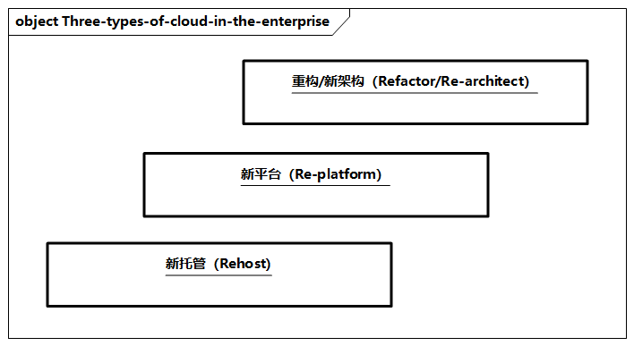
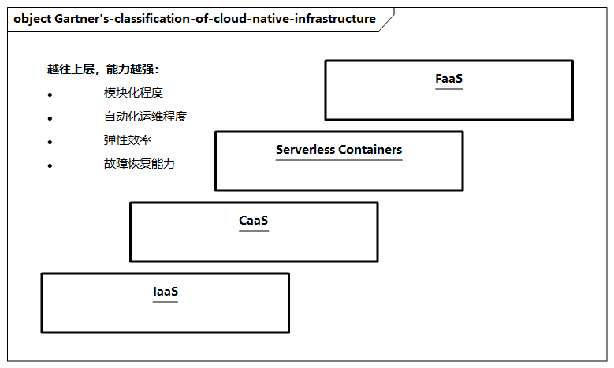

# 技术基础设施上云

从技术架构基础设施角度，越来越多的企业选择使用云计算，逐步将企业的应用搬到云上。这里我们来看看企业上云的好处和通用方法。

什么是上云？上云指的是企业以云计算的服务能力为基础，进行信息化系统及相关业务应用的建设并对外连接的过程。上云可以帮助企业解决技术统一、业务统一的问题；可以支持敏捷开发，加速业务快速创新；还可以帮助企业降本增效。云计算通过资源池和虚拟化技术，让应用和底层基础设施解耦，进而提高资源的利用率，并通过资源弹性使得云基础设施和传统IDC（互联网数据中心）对比具有明显优势。

企业上云一般可分为三种类型。

> 图例：企业上云的三种类型

- 第一类是**新托管（Rehost）**，通过迁移的方式，将线下物理机替换为云上虚拟机，比如计算、存储、网络的云资源；
- 第二类是**新平台（Re-platform）**，用托管的云服务替换线下自建应用基础设施，并越来越渗透到PaaS层，比如数据库、中间件、监控、应用生命周期等，从而具备更好的弹性、稳定性和自治运维能力；
- 第三类是**重构/新架构（Refactor/Re-architect）**，进行深层次的微服务或云原生应用架构改造，以及对应的DevOps整体研发流程改造。

可以看出，上云不仅是简单地使用一些计算、网络、存储等云资源，更重要的是**从Rehost向Re-platform，进而向Re-architect升级**。

在此过程中，虽然上云的成本和复杂性逐步增加，但是在其他方面（比如敏捷性、弹性、可用性、容错性等）的收益也在持续增加，因此企业上云需要综合考虑自身的业务和技术特点，选择适合自己的上云节奏。

在上云过程中，企业需要遵从以下原则。

1. **选择好架构模式**：要充分结合各种架构模式的优缺点，根据具体的应用场景进行选择，比如N层架构、微服务架构、事件驱动架构、大数据架构及高性能计算架构等。
2. **单一还是多云**：企业需要结合实际现状，一般多个供应商对接的成本更高，但如果企业一定要与多个供应商合作，则建议将相对独立的应用模块放在同一个云中，将其他应用模块放在另外的云，而不是将单个应用模块部署到多个云中。
3. **充分评估转化成本**：当选择云供应商或者云服务时，需要充分评估转化成本，不同的云及云产品在功能、性能、成本、可靠性等多方面都有差异，因此要进行综合评估。
4. **重视非功能性**：一个设计良好的上云架构在满足功能性需求的同时，需要充分考虑非功能性需求，尽可能利用云服务来简化这些非功能性需求的实现，需要重点考虑性能效率、可靠性、兼容性、可执行性和可维护性。

企业应用上云需要紧密结合自身的业务和技术特点，可以采用以下通用的几个步骤。

1. **确认上云需求**：首先需要收集和确认应用上云的需求。此过程需要结合其他架构（如业务架构、应用架构），并与不同的人员交流和讨论，收集各方的痛点。从上云的视角来看，需要重点考虑工作负载（工作负载对高可用及容灾的需求）、业务增长（如大促峰值的增长）、成本管理（如资源消耗等）、时间目标（如恢复时间目标等）、安全合规（如数据隐私等）等。
2. **考虑架构原则**：在确认了上云需求之后，需要综合考虑架构模式和原则，明确上云的非功能性需求，比如比较多种架构模式，以及确定是使用单一还是多云提供商，同时评估上云的转化成本和风险，并重点考虑性能效率、可靠性、兼容性、可移植性、可维护性等原则，确定上云的核心架构原则与相应指标。
3. **选择云上服务**:使用标准云产品是上云的关键路径，可以帮助我们全面解耦应用与云资源，充分利用云计算带给我们的技术红利，让云服务最大限度地解决企业的非功能性需求。云上服务也有非常多的种类，涉及基础设施、接入层、中间件、消息、数据存储、大数据、安全、产品研发等多个方面。
4. **制订上云方案**:进而，企业可以基于需求、架构原则及云服务选型制订整体的上云方案，建议从全局视角进行总体规划，并对核心的架构原则及云服务选型进行充分阐述，并制订出具体的分步实施计划，并请企业高层（如CTO/CIO）及架构委员会进行评审。
5. **实施上云项目**:企业可以通过项目进行推进，包括上云的项目管理、组织流程、质量保障、风险识别等，特别是相关的进度和上云前的各种压测，以及一些上云过程中的预案处理。

云计算的“下一站”是云原生，企业上云的趋势也是云原生基础设施。

Gartner将云原生基础设施划分成四大类，主要分为`IaaS`、`CaaS（Container as a Service）`、`Serverless Containers`（如`ASI`）、`FaaS`（如函数计算）。可以看出，从下往上，计算单元的粒度越来越细，越来越体现云原生的特质，体现在模块化程度、自动化运维程度、弹性效率、故障恢复能力等方面。

可以说，云**原生基础设施是应用研发和运维的最佳实践的组合**（如容器化、持续集成和交付、不可变基础设施等），使分布式系统更加可靠、易管理和易观测，提升研发运维的效率；同时使云原生的优势和云厂商的传统优势（如规模、稳定性和弹性）完美结合，并通过开放的社区标准与各大云提供商的商业化服务能力，极大地改变了用户的心智。可以预计，云原生基础设施将大大简化企业上云的过程，并结合新一代计算单元、`Serverless Containers`、函数计算、分布式云环境等更加灵活地适配企业多种上云诉求。
