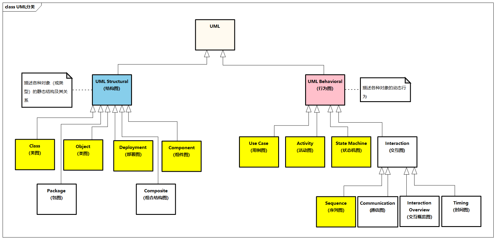

# 技术架构制图

在架构设计领域，架构制图是针对系统架构某一个方面的一种描述，将系统的技术方案、技术选型通过视图的方式进行展现。架构制图可以帮助团队内部和团队之间消除沟通歧义，提升协作效率。一图胜千言，无图无真相。图是直观而形象的，顺应了人类与生俱来的视觉识别本能，一张图所能传达的信息非常多。常见的技术架构制图有功能架构制图、系统分层架构制图、系统链路架构制图、部署架构制图、开发架构制图等。

## 架构制图的原则

国际上对架构描述设立了专门的标准（ISO/IEC/IEEE 42010:2011），架构制图是架构的载体，从制图本身角度，架构制图需要关注以下几个方面。

- **深刻理解制图目标**：架构制图需要有明确的目标，需要准确、完整、清晰、一致、简洁。
- **明确受众及关注点**：比如业务、产品、开发、测试、运维、外部客户、行业专家等。
- **考虑全面，有所侧重**：架构制图需要跳出图本身，全面展示涉及的内容，避免“只见树木，不见森林”；同时需要针对受众和关注点有所侧重，略去与当前视图无关的细节。
- **充分采用设计方法**：建议采用结构化思维，比如金字塔原理、结论先行、以上统下、归纳分组、逻辑递进。
- **采用多种架构视图**：可以采用不同的视图来进行描述，比如从工程制图角度，有主视图、俯视图、左视图等。
- **遵守统一的图例规范**：比如UML中泛化、聚合、组合、依赖等关系的表达，以及各种方框、虚实线、箭头的含义，特别是组件之间的交互方式，比如同步或异步。
- **持续优化迭代**：与软件一样，架构制图也有版本，核心是表达清楚图的内容，突出最重要的地方，架构制图的粒度、类别、内容等可以逐步完善。

## 架构制图的方法

### UML

UML（Unified Modeling Language）是统一建模语言的简称，它是一种由一整套图表组成的标准化建模语言。UML用于帮助系统开发人员记录软件系统的产出。UML主要使用图形符号来表示软件项目的设计，帮助项目团队沟通和进行软件设计。

UML总共包含十几种不同类型的图，可以覆盖软件设计领域各种制图需求，主要分为如下两大类图。

> 图例: UML分类

- **结构图（Structural Diagrams）**：通过对象、属性、操作和关系等，强调系统的静态结构，包括类图（Class Diagram）、组件图（Component Diagram）、部署图（Deployment Diagram）、对象图（Object Diagram）、包图（Package Diagram）、组合结构图（Composite Structure Diagram）。
- **行为图（Behavioral Diagrams）**：通过展示对象之间的协作关系及对象内部的状态改变，强调系统的动态行为，包括用例图（Use Case Diagram）、活动图（Activity Diagram）、序列图（Sequence Diagram）、状态机图（State Machine Diagram）、通信图（Communication Diagram）、交互概述图（Interaction Overview Diagram）、时序图（Timing Diagram）。

下面简单介绍几种常用的UML制图。

- **类图（Class Diagram）**：类图是一切面向对象的核心建模工具，描述系统中对象的类型及它们之间存在的各种静态关系。
- **组件图（Component Diagram）**：组件图描述组件如何连接在一起以形成更大的组件或软件系统。它展示了软件组件的体系结构及它们之间的依赖关系。
- **用例图（Use Case Diagram）**：用例图从用例的角度描述系统的功能需求，它是系统预期功能（用例）及其环境（参与者）的模型。
- **活动图（Activity Diagram）**：活动图用于展示工作流程，它支持选择 （Choice）、迭代（Iteration）和并发（Concurrency）。活动图描述目标系统的业务流程。
- **状态机图（State Machine Diagram）**：状态机图描绘允许的状态和转换，以及影响这些转换的事件，有助于可视化对象的生命周期管理。
- **序列图（Sequence Diagram）**：序列图根据时间序列展示对象如何进行协作。它展示了在用例的特定场景中，对象如何与其他对象进行交互。

对于通用的一些UML原则，[《码出高效：Java开发手册》](https://m.douban.com/book/subject/30333948/)给出了比较详细的介绍，这里挑选并提炼其中几条。

- 在需求分析阶段，如果与系统交互的对象超过一类并且相关的用例超过5个，则使用用例图来表达更加清晰的结构化需求。
- 如果某个业务对象的状态超过3个，则使用状态机图来表达并且明确状态变化的各个触发条件。
- 如果系统中某个功能的调用链路上涉及的对象超过3个，则使用时序图来表达并且明确各调用环节的输入与输出。
- 如果系统中模型类超过5个，并且存在复杂的依赖关系，则使用类图来表达并且明确各类之间的关系。
- 如果系统中超过2个对象之间存在协作关系，并且需要表示复杂的处理流程，则用活动图来表示。
- 谨慎使用继承的方式进行扩展，优先使用聚合或组合的方式。
- 在进行系统设计时，根据依赖倒置原则，尽量依赖抽象类与接口，这样有利于扩展与维护，需要注意的是，应对扩展开放，对修改闭合。
- 在系统设计阶段，共性业务或公共行为抽取出来公共模块、公共配置、公共类、公共方法等，避免出现重复代码或重复配置的情况。

### “4+1”视图模型

1995年，[Philippe Kruchten](https://www.researchgate.net/profile/Philippe-Kruchten)发表了题为[“The 4+1 View Model of Architecture”](https://www.researchgate.net/publication/220018231_The_41_View_Model_of_Architecture)的论文，引起了业界的关注。此论文提出了一种用来描述软件系统体系架构的模型，以架构为中心场景驱动和迭代开发等方式实现设计。“4+1”视图模型基于不同项目干系人，从4种基础视图和场景方面来描述软件需求。

> 图例：“4+1”视图模型

- **场景（Scenarios）**：场景用于描述系统的参与者与功能用例间的关系，反映系统的最终需求和交互设计，通常用用例图表示。
- **逻辑视图（Logical View）**：逻辑视图用于描述系统软件功能拆解后的组件关系，反映系统整体组成与系统构建过程，通常用组件图和类图表示。
- **物理视图（Physical View）**：物理视图用于描述系统软件到物理硬件的映射关系，反映系统的组件部署关系，通常用部署图表示。
- **流程视图（Process View）**：流程视图用于描述系统软件组件之间的通信时序、数据的输入和输出，反映系统的功能流程与数据流程，通常用时序图和活动图表示。
- **开发视图（Development View）**：开发视图用于描述系统的模块划分和组成，以及细化到内部包的组成设计，反映系统开发实施过程，通常用组件图和包图表示。

### C4模型

C4模型来自[《程序员必读之软件架构》（Software Architecture for Developers）](https://item.jd.com/10026523364580.html)一书，C4模型是一种“抽象优先”的架构制图方法，它是受[UML](#uml)的启发而开发出来的，但相对而言，C4模型更加简单和轻量，只包含少量的一组抽象和图表，易于学习和使用，如图7-4所示。

> 图例：C4模型示意图

C4代表**上下文（Context）**、**容器（Container）**、**组件（Component）** 和 **代码（Code）** 分层的图表，可以用这些图表来描述不同缩放级别的软件架构，每种图表适用于不同的受众。

C4模型最关键的思想就是**自上而下对系统的静态结构进行逐级拆分，依次描述各层次对象的职责、关系和外部依赖**。此外，它还可以包含动态视图、部署视图等补充视图。举个例子，一个软件系统由多个容器（如数据库、应用）组成，一个容器由多个组件组成（如微服务和技术组件），一个组件由多个代码（如接口类、实现类、领域对象类）结构组成。

## 技术架构视图参考

技术架构视图可分为多种类型，比如系统功能架构、开发架构、测试架构、部署架构、运维架构、安全架构、集成架构、数据交互架构等视图，下面简要介绍几种技术架构视图。

### 开发架构视图

开发架构视图提供软件系统各模块的组织结构，涉及系统的各个层面，包含软件复用技术应用、设计和测试的标准化、代码组织管理等。开发架构**主要面向技术开发人员**，一方面强调软件开发生命周期的各阶段，另一方面重视对已有资产的封装、管理和重用，强调统一建模和设计的重要性。


> 图例：开发架构视图

上图展示了一个例子，从分层角度，开发架构包括网关层、应用层、服务层、技术底座层、基础设施层等。

**整个框架体现一个目标：以基础设施层为依托，以技术底座层为开发准则，以应用层和服务层为核心，通过网关层，全面为各层次提供高质量的服务**。

- **网关层**更体现不同用户和终端的接入
- **应用层**和**服务层**承接应用架构的部分能力
- **技术底座层**更体现统一的技术与开发管理能力，如应用管理、项目管理、集群管理，这一层提供统一的资源分配及调度，并提供完整的`CI/CD`、`DevOps`、代码托管等能力，打通业务开发与基础设施，屏蔽基础设施中复杂的技术细节，并提供对接其他系统的能力
- **基础设施层**提供基础资源，比如计算资源、数据存储资源、服务资源等

### 部署架构视图

部署架构视图**主要面向运维人员**，维持系统运行的各种服务，包括运维安全管理、网络设施管理、基础服务管理、配置管理、基础设施和环境管理，以及相关的规章制度和管理流程等。

部署架构有时也叫作物理架构，需要考虑一些因素，比如网络情况、流量调度、隔离的环境、运行时功能或数据迁移、状态性能监控、系统配置、数据和系统备份及还原等，还要考虑如何保障系统的稳定性，在出现运行故障时能够进行容错和快速恢复，包括安装、迁移、管理和支持活动，同时这些活动需要尽可能自动化。

> 图例：部署架构视图

上图展示了一个基于`Spring Cloud`体系的部署架构，包括服务注册集群、服务配置中心、业务服务容器、服务监控和保护、流量控制和负载均衡、认证鉴权等集群组件的部署。

### 安全架构视图

安全架构视图定义了企业向业务部门提供的安全范围和功能，贯穿整个企业架构的安全环节，是业务安全运行的基础架构。

> 图例：安全架构视图

安全架构包括身份和访问管理、开发安全管理、运维安全管理和集成架构安全等，以及合规等安全运营管理等。

安全架构对企业非常重要，涉及的面很广。比如，从系统数据安全角度，需要敏感数据保护、数据传输加密、数据存储加密等；从系统应用安全角度，涉及应用防火墙保护、应用配置安全、代码安全、漏洞扫描等；从系统账号安全角度，需要进行身份认证、访问授权、账号管理、操作审计等；从系统安全监控运营角度，需要进行威胁检测、配置检查、日志审计、备份恢复等。
