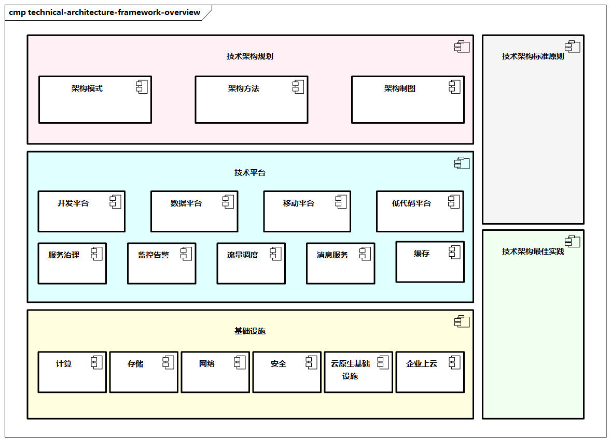

# 技术架构设计框架

技术架构涉及技术架构规划、技术平台、基础设施，以及技术架构标准原则、最佳实践等。

> 图例：技术架构设计框架总览

- **技术架构规划**：对技术架构统一规划的指导，包括架构模式、架构方法、架构制图等。
- **技术平台**：技术架构的平台组件能力，包括开发平台、数据平台、移动平台、低代码平台等，以及核心的典型技术，如服务治理、监控告警、流量调度、消息服务、缓存等。
- **基础设施**：支撑技术架构的基础设施，比如计算、存储、网络、安全及云原生基础设施等，可以充分考虑企业上云相关技术。
- **技术架构标准原则**：企业技术方向性的通用原则，如通用技术原则、技术框架原则、服务开发设计原则、架构制图原则等。
- **技术架构最佳实践**：技术架构典型的实践，如一致性、高并发、高可用、安全生产、压测、秒杀、企业上云等。
